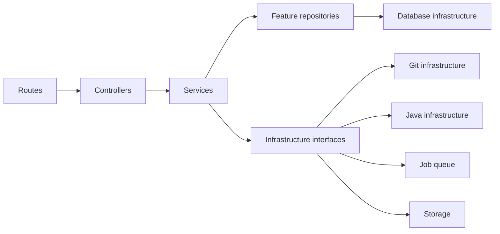

# Projex Backend Structure

## Decision

Projex will use a **feature-based modular monolith** for the planned Node.js/Express/TypeScript backend. This document describes a future structure; Phase 0 does not create these folders or implement backend code.

The frontend remains in its current React/Vite JavaScript/JSX structure under `client/`. The feature-based Express/TypeScript backend exists under `server/`; Phases 8A through 8C add controlled-local provisioning, authenticated transport, and read-only repository inspection without changing the frontend.

## Proposed structure

```text
server/
  src/
    app.ts
    server.ts
    config/
      env.ts
    middleware/
      authenticate.ts
      authorize.ts
      csrf.ts
      error-handler.ts
      request-context.ts
      rate-limit.ts
    modules/
      auth/
      users/
      classes/
      class-members/
      activities/
      test-cases/
      submissions/
      assessments/
      feedback/
      project-tasks/
      teams/
      repositories/
      repository-members/
      repository-invitations/
      notifications/
      analytics/
    infrastructure/
      database/
      git/
      java/
      job-queue/
      storage/
      logging/
    shared/
      errors/
      http/
      ids/
      pagination/
      time/
      types/
  prisma/
    schema.prisma
    migrations/
    seed.ts
  tests/
    integration/
    support/
```

Each feature directory should normally contain:

```text
feature-name/
  feature.routes.ts
  feature.controller.ts
  feature.service.ts
  feature.repository.ts
  feature.schemas.ts
  feature.types.ts
  feature.test.ts
```

Names may be singular when the feature represents a process rather than a collection, but the role of each file must remain recognizable. Small modules may begin with fewer files; they must not combine HTTP, business rules, and persistence in one large file.

## Layer responsibilities

### Routes

- Declare paths beneath `/api/v1`.
- Apply authentication, role/permission, CSRF, rate-limit, and validation middleware.
- Bind HTTP methods to controllers.
- Contain no database calls or domain decisions.

### Controllers

- Translate validated HTTP input into a service command/query.
- Read the authenticated principal from server-created request context.
- Select the correct HTTP status and standard response envelope.
- Pass errors to the central error handler.
- Contain no Prisma calls, shell execution, or complex authorization logic.

### Services

- Own use-case orchestration and business rules.
- Enforce backend role, ownership, membership, lifecycle, deadline, and visibility checks.
- Coordinate transactions through repositories/database infrastructure.
- Enqueue work and call infrastructure through typed interfaces.
- Build role-appropriate result objects; for example, exclude hidden tests and detailed similarity information from student results.

### Repositories

- Encapsulate Prisma queries for the owning feature.
- Use explicit selections rather than returning every column by default.
- Accept transaction clients when a service coordinates an atomic operation.
- Keep persistence mapping out of controllers.
- Do not perform authorization merely because a matching row exists; services authorize the action.

### Validation schemas

- Use Zod for params, query strings, request bodies, environment variables, job payloads, and infrastructure results.
- Reject unknown or unsafe fields when appropriate.
- Normalize only safe transport concerns; business defaults remain in services.
- Export inferred TypeScript input types where useful.
- Never accept a frontend-provided role, owner ID, storage path, compiler command, or Git command as authoritative.

### Tests

- Unit-test service rules and validation schemas.
- Integration-test routes, middleware, Prisma repositories, transactions, and authorization against a test database.
- Contract-test standard response envelopes and student/instructor/admin data visibility.
- Concurrency-test server-assigned submission attempt numbering, attempt limits, idempotent retries, and immutable attempt history.
- Worker-test Java timeouts/limits and Git path/argument validation.
- Add regression tests before changing a functionalized UI workflow.

## Feature ownership

| Feature | Primary responsibility |
| --- | --- |
| `auth` | Login, logout, session creation/rotation/revocation, current principal, password verification. |
| `users` | User profiles, account status, and `STUDENT`, `INSTRUCTOR`, `ADMIN` role assignments. |
| `classes` | Class workspace identity, course/section/term context, instructor assignment, and unique class-code generation/rotation/revocation. |
| `class-members` | Code-based student join, duplicate prevention, active/deactivated membership state, historical membership preservation, and authorization queries. Full class invitation lifecycle is a later enhancement. |
| `activities` | Title/instructions, publication state, due date, visibility, `maxAttempts` (1-3), starter code, total points, programming-language setting, and activity lifecycle. |
| `test-cases` | Visible/hidden test authoring, ordering, points, secure retrieval for workers. |
| `submissions` | Immutable official attempts and visible-only practice runs, server-owned chronological numbering, counting-attempt enforcement, scoped idempotency, snapshots, durable job creation, instructor review/corrections, infrastructure-failure resolution/replacement, release, and role-safe history retrieval. |
| `assessments` | Logical assessment boundary currently coordinated by submissions plus Java/job-queue infrastructure: preserved per-test results, original/effective automated scores, instructor points, bounded final score, and execution lifecycle. It may become a separate feature only when its responsibilities warrant extraction. |
| `feedback` | Submission-owned instructor feedback drafts and controlled release in Phase 6; rubric results and notification coordination remain later work. |
| `project-tasks` | Class-linked project requirements, lifecycle, due dates, team summaries, monitoring, and archive gates. |
| `teams` | Phase 7 persistence owned by the repository-collaboration aggregate: project teams, immutable lead identity, and synchronized membership rules. |
| `repositories` | Phase 7 repository metadata, server-owned visibility, review lifecycle, textual feedback, and the transaction boundary for teams, members, and invitations. |
| `repository-content` | Phase 8C authenticated read-only summary, branch, reachable commit, tree, bounded text-file, and diff projections over READY managed Git storage. |
| `repository-members` | Phase 7 persistence owned by the repository aggregate: synchronized collaborator membership and removal/reactivation history. |
| `repository-invitations` | Phase 7 persistence owned by the repository aggregate: eligible collaborator invite creation, acceptance, decline, revoke, expiry, and capacity. |
| `notifications` | In-app notification creation, listing, unread counts and read state. |
| `analytics` | Authorized read models derived from persisted academic activity; no ownership of source transactions. |

## Infrastructure ownership

| Infrastructure module | Responsibility | Must not do |
| --- | --- | --- |
| `database` | Prisma singleton/factory, transaction helpers, health checks, migration support | Decide feature authorization or expose Prisma directly to controllers. |
| `git` | Validated Git argument arrays, bare repos, worktrees, locks, result parsing | Accept shell strings, client paths, or use GitHub/GitLab APIs for core behavior. |
| `java` | Worker protocol, compile/run limits, output normalization, temp cleanup | Execute in the API process or accept client shell commands. |
| `job-queue` | Initially PostgreSQL-backed durable job records, atomic claim/lease, retry fields, bounded concurrency, terminal state, and separate worker coordination | Require Redis/RabbitMQ, hide business transitions, or run arbitrary payloads. |
| `storage` | Server-owned paths, file metadata, bounded reads/writes, cleanup | Trust filenames/paths from clients or expose storage roots. |
| `logging` | Structured logs, redaction, correlation IDs, security/job events | Log secrets, cookies, passwords, full source code or hidden tests. |

## Dependency direction



Dependencies point inward toward use cases. Infrastructure must not import Express controllers or frontend code. Controllers must not import Prisma, child-process APIs, or filesystem APIs.

## Cross-feature collaboration

- A service may call another feature's public service/query interface; it must not reach into that feature's repository tables casually.
- The owning service controls mutations. For example, feedback release may ask submissions for authorization/status, but it must not rewrite submission rows directly.
- Transactions spanning features are coordinated at the service layer with an explicit transaction client.
- Notifications and analytics should consume committed domain events or explicit post-transaction calls. They must not make the primary academic transaction dependent on optional analytics work.
- Circular dependencies are resolved by extracting a narrow shared contract or orchestrator, not by importing internal files in both directions.

## Submission and assessment collaboration

- `activities` supplies lifecycle, due date, allowed total score, programming language, visibility, and `maxAttempts`.
- `submissions` atomically determines the next attempt number; no controller or frontend payload may choose it.
- A submission attempt becomes immutable after successful creation and permanently retains its snapshot and academic history.
- `submissions` creates the durable assessment job in the same transaction as the immutable attempt and idempotency record; the separate worker claims it only after commit.
- Java/job-queue infrastructure preserves deterministic test-case results and `originalAutomatedScore`; instructor review records append-only corrections and distinct instructor points.
- Submission feedback controls draft/release visibility and timestamps without overwriting automated assessment evidence.
- Infrastructure retries reuse the same immutable submission. A replacement is a new linked submission created only by atomically consuming one unexpired grant.

## Error and configuration boundaries

- Services throw typed application errors with stable machine codes.
- The global error handler maps known errors to the API error envelope and hides internal details.
- `config/env.ts` validates environment variables with Zod at startup; the server fails fast on invalid configuration.
- Feature modules receive configuration or infrastructure clients through explicit construction/composition in `app.ts`, not by reading environment variables throughout the codebase.

## Initial implementation order

1. Application/configuration, error envelope, logging, database, and health endpoint.
2. Auth, users, sessions, and all three role foundations.
3. Classes and simplified code-based class membership.
4. Activities and test-cases.
5. PostgreSQL-backed execution queue and controlled-local Java worker.
6. Immutable submission attempts, Run Visible Tests, automated assessment, append-only correction, instructor review, failure resolution/replacement, and release.
7. Project tasks, teams, repository metadata, members/invitations, and collaboration workflows.
8. Local Git infrastructure and repository operations.
9. Backend-focused Admin capabilities and safe operational projections.
10. Frontend integration, including a Phase 10D Admin redesign based on the student/instructor visual language.
11. Notifications, analytics, similarity, security/integration/laboratory testing, and temporary internet deployment.

Only the approved feature should be functionalized at each step. Unrelated frontend mocks stay in place until their feature phase begins.

## Phase 8A process boundary

`src/git-worker.ts` is a separately started development-only process. `infrastructure/git` owns the typed bounded Git runner, `infrastructure/storage` owns canonical UUID-derived paths and guarded cleanup, and `infrastructure/job-queue/repository-provisioning-queue.ts` owns PostgreSQL claim/lease state. The repository feature service coordinates these interfaces. Neither API requests nor migrations execute Git.

## Phase 8B transport boundary

`modules/git-transport` owns credential issuance/revocation, current authorization evaluation, transport route validation, and successful-push activity persistence. `infrastructure/git/git-smart-http.ts` owns the bounded CGI adapter and `git-transport-hook.ts` owns server-generated pre/post-receive policy enforcement. The API may stream only allowlisted Smart HTTP services through the configured absolute `git-http-backend`; it accepts neither commands nor paths and exposes no general Git execution.

The transport is disabled by default, loopback-only in controlled development, and separate from Phase 8A provisioning.

## Phase 8C read boundary

The `repository-content` feature owns HTTP validation, current source authorization, safe projections, and error mapping. The Git reader infrastructure owns fixed command shapes, reachable-revision checks, output parsing, time/size limits, and binary rejection. It receives only server-resolved canonical repository paths and never imports Express or Prisma. No database migration or write worker is added.
