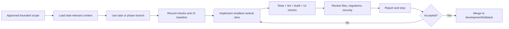

# Projex Development Workflow

## Working principles

- Development is local-first.
- The existing React/Vite JavaScript/JSX frontend is preserved.
- The backend is implemented incrementally through explicitly approved task or phase branches. Completed phases remain the baseline for each subsequent phase.
- Work remains cloud-provider-neutral and deployable later to a temporary VPS, GitHub Student Developer Pack credits, Azure for Students, another student cloud credit, or an SLU host.
- Student and Instructor core workflows are implemented first. Phase 9 defines backend Admin capabilities; the current admin mock is not the final visual design, and Phase 10D will redesign it from the student/instructor visual language.
- Each phase stops when its requested scope is complete; it does not begin the next phase implicitly.

## Branch model

| Branch | Purpose |
| --- | --- |
| `main` | Stable accepted baseline. Only verified phase integrations are merged here. |
| `backup/ui-hardcoded` | Preserved hardcoded UI reference. Do not rewrite it as an active development branch. |
| `development/fullstack` | Full-stack integration branch and base for approved phase work. |
| Task or phase branches | Short-lived branches for one approved phase, feature slice, or documentation task. |

Each task or phase branch starts from the latest accepted full-stack commit unless the approved work requires another explicit base. Before branching, verify that the selected base contains every accepted prior phase. `development/fullstack` remains the integration branch, but it must not be used as a base while it is behind accepted phase work.

Use clear phase names such as:

```text
phase/01-backend-foundation
phase/02-database-foundation
phase/03-authentication-authorization
phase/04-user-class-management
phase/05-activities-test-cases
phase/06-submissions-automated-assessment
phase/07-project-repository-collaboration
phase/08-local-git-operations
phase/09-admin-functionalization
phase/10-frontend-integration
phase/11-hardening-deployment-evaluation
```

If repository policy later requires a prefix, preserve the phase identity, for example `codex/phase-04-user-class-management`.

Rules:

- Do not commit directly to `main` for feature work.
- Do not merge a task or phase branch until its acceptance criteria and relevant migrations, tests, lint/build, and UI regression checks pass.
- Keep `backup/ui-hardcoded` available as a visual/behavioral comparison; do not use destructive history rewriting to maintain it.
- Rebase/merge policy may be chosen by the maintainers, but shared history must not be force-pushed without explicit coordination.
- Codex may stage, commit, and push to the current task or phase branch only when the approved work order explicitly authorizes those operations and all required checks pass.
- Merging into `development/fullstack` or `main` is always a separate approval gate.

## Commit discipline

- Make small, coherent commits that can be reviewed and reverted independently.
- Separate schema/migration, backend behavior, frontend adapter, and test changes when doing so keeps each commit valid.
- Do not mix formatting, CSS redesign, dependency upgrades, and feature functionalization in one commit.
- Commit messages state the outcome and feature, for example `feat: implement submissions and automated assessment`.
- Never commit `.env`, credentials, generated runtime storage, Java job directories, Git repositories/worktrees, logs, database dumps with private data, or build output.
- Report every changed file in the phase handoff.

## Phase workflow



For each bounded task or phase:

1. Confirm branch and clean/understood worktree.
2. Read effective `AGENTS.md`, inspect actual Git state, inspect target source and nearest tests, and load the owning subsystem document.
3. Load additional API, security, database, Git, Java, frontend, or historical documents only when the affected boundary or a discovered dependency requires them.
4. Record relevant baseline failures and capture desktop/narrow UI views before an approved frontend binding change.
5. Implement the smallest coherent approved slice.
6. Keep unrelated mocks and routes intact.
7. Add/update unit, integration, authorization, transaction, and regression tests proportional to the change.
8. Run the required checks and inspect the actual diff.
9. Report the outcome, logical changes, checks actually run, known limits, and next approval gate.
10. Stop before the next phase or unrelated task unless it is explicitly authorized.

Every phase or bounded task must leave the affected application and documentation coherent. An unfinished cross-phase refactor, disabled unrelated route, or partially replaced global mock layer is not an acceptable handoff.

## Task intake and selective context

An effective bounded work order identifies:

- the desired outcome;
- included and excluded scope;
- observable acceptance criteria;
- authority for migrations, credentials, Git operations, deployment, or other protected actions; and
- the next stop boundary.

Low-risk implementation may proceed without a separate planning round when the requested behavior is already explicit, bounded, and authorized. New phases, ambiguous product behavior, schema design, major architecture, security boundaries, hosted exposure, frontend redesign, and meaningful dependency changes require planning or clarification before implementation.

Repository evidence outranks stale status text and conversation summaries. Verify mutable facts rather than copying them into additional tracking files. Do not reread or summarize unchanged documents unless a task-relevant conflict requires it.

## Frontend preservation rules

- Keep React, Vite, JavaScript/JSX, React Router, existing CSS, and current user-visible route structure.
- Do not convert the frontend to TypeScript.
- Preserve layout hierarchy, class names, spacing, responsive behavior, and current interactions unless the approved feature requires a minimal change.
- Do not redesign unrelated components.
- Do not change `src/App.css` unless the requested feature cannot be completed correctly without it. Any CSS change must be minimal and visually verified.
- Prefer JavaScript API adapters/view-model mapping so backend DTOs fit existing component expectations.
- Do not remove mocks outside the requested feature.
- When live data replaces a mock, preserve deterministic fixtures for tests and documented visual states.
- Replace data one feature and one workflow at a time; never replace all mocks in one pass.
- Verify desktop and narrow/mobile views for every touched route.

## Backend implementation rules

- Use Node.js, Express, TypeScript, Zod, Prisma ORM, and PostgreSQL.
- Follow the feature-based structure in `BACKEND_STRUCTURE.md`.
- Keep routes/controllers thin; services own rules; repositories own Prisma queries.
- Validate every boundary with Zod and enforce authorization in services/middleware.
- Use `/api/v1` and the standard response envelopes.
- Use migrations for schema changes and transactions/constraints for invariants.
- Do not use external Git or compiler APIs.
- Do not run Git or Java through shell-concatenated strings.
- Do not run Java execution in the API process.
- Use a free, self-hosted, cloud-provider-neutral initial execution queue, normally PostgreSQL job records plus a separate worker, atomic claim/lease/retry fields, bounded concurrency, and terminal states.
- Preserve immutable, server-numbered submission records. Enforce `maxAttempts` against counting attempts while preserving non-counting infrastructure failures and linked replacement history.
- Preserve each attempt's source, submission time, execution result, score, and review state; idempotency and database constraints must protect double-click/retry behavior.
- Keep `originalAutomatedScore` and per-test automated evidence immutable during review; record append-only corrections, distinct instructor points, and the derived released final score separately.
- Keep Java execution disabled by default. Permit `local_process` only for controlled local development, never production or an internet-accessible deployment.
- Phase 7 repository work remains the academic metadata baseline. Phase 8A provisions verified empty bare repositories; Phase 8B transports authenticated clone/fetch/push and records only real accepted push activities; Phase 8C provides authenticated read-only repository inspection without creating Git history.
- Preserve team/repository membership synchronization through serializable transactions, database constraints, and real PostgreSQL integration tests; never bypass the invariant with direct one-table writes.
- Do not add provider-specific infrastructure without a documented, approved portability exception.

## Environment workflow

- `.env` is local/private and never committed.
- `.env.example` is committed whenever a new required variable is introduced; values are safe placeholders and descriptions.
- Local development and hosted environments have separate values and secrets.
- Environment validation fails fast at backend startup.
- Use a dedicated local/test PostgreSQL database; automated tests must not target a developer's normal data or a hosted defense database.
- Use distinct local/test roots for Git, storage, Java jobs, and temporary work.
- Commands that reset databases or delete runtime storage must verify the exact environment and target path before acting.

## Verification matrix

The exact commands are defined when backend tooling exists. At minimum, a phase must run all configured relevant checks:

| Area | Required verification |
| --- | --- |
| Frontend | Existing lint, production build, relevant route smoke tests, desktop and narrow visual inspection. |
| Backend | Type check, lint, unit tests, integration tests, production build/startup validation. |
| Database | Migration apply on a clean database, migration apply on representative prior state, constraints/transaction tests, seed test. |
| API | Response-contract, validation, authentication, authorization, pagination, error-code tests. |
| Repository collaboration | Lifecycle/deadline rules, server-owned visibility, cross-class concealment, invitation eligibility/expiry/capacity/concurrency, synchronized membership rollback, feedback/review coupling, and archive blockers. |
| Java | Separate-worker compile success/failure with `--release 17`, timeout/output boundaries, process-tree termination, temp cleanup, and hosted network/CPU/filesystem isolation before internet enablement. |
| Git | Executable/version and canonical-path validation, bare-repository lifecycle, credential/revocation/current-membership authorization, Smart HTTP streaming limits, ref-policy atomicity, cleanup, and guarded real-Git tests. |
| Security | Secret scan/diff review, cookie/CSRF/CORS/headers, role/ownership tests, student visibility tests. |

A failing pre-existing check must be reported with evidence. New failures caused by the phase must be fixed before merge.

## Dependency changes

- Install only dependencies required by the approved phase.
- Explain why each new dependency is needed and prefer maintained, focused packages.
- Review package scripts and lockfile changes.
- Do not replace existing frontend dependencies merely to standardize the stack.
- Security-sensitive or native dependencies require extra review for hosted portability.

## Hosted deployment workflow

Deployment comes after local functionality and isolation controls pass.

- Package the frontend, API, workers, PostgreSQL connection, and persistent storage using portable configuration.
- Place a TLS reverse proxy in front of the static frontend and API.
- Keep provider-specific setup outside core feature modules.
- Configure a temporary VPS, GitHub Student Developer Pack credit, Azure for Students, another student cloud environment, or an SLU host with separate hosted secrets.
- Self-host PostgreSQL, OpenJDK/Java workers, and Git; do not make a cloud provider or Cloudflare Tunnel mandatory.
- Run migrations as a controlled release step.
- Restrict accounts/data and define the testing/defense availability window.
- Verify backup/restore, logs, worker limits, health checks, and shutdown procedure.
- Document the hosted URL and test accounts privately; never commit credentials.
- Remove or disable the temporary deployment after the approved use period.

University-wide deployment, high availability, multi-server failover, autoscaling, on-call operations, and a 24/7 SLA are out of scope.

## Codex execution and approval boundaries

Within an explicitly approved scope, Codex may inspect the repository, choose implementation details consistent with accepted architecture, implement the behavior, fix directly related defects, update directly related tests/documentation, run focused and affected regression checks, repeat the diagnose/fix/test cycle, review the final diff and security boundaries, and provide one completion report.

Ordinary lint, import, compilation, test-fixture, or directly related test failures do not require a new approval round. Stop when they reveal or require:

- new product scope or major architecture;
- destructive or difficult-to-reverse action;
- a normal-development database migration that was not explicitly authorized;
- persistent credential or environment changes;
- deletion of non-test data or material data-loss risk;
- weakened authorization, validation, isolation, security, or required testing;
- a dependency installation or upgrade with meaningful impact;
- production or non-loopback exposure;
- an unrelated subsystem change;
- a merge into `development/fullstack` or `main`, force push, history rewrite, protected-branch change, or branch deletion; or
- deployment.

## Decision placement

- Record accepted subsystem behavior in the owning architecture document.
- Record cross-system design and trust-boundary decisions in `SYSTEM_ARCHITECTURE.md`.
- Record accepted phase milestones and remaining gates in `PHASE_CHECKLIST.md`.
- Use Git commits for the implemented change history and rationale.
- Do not create a second volatile state record when Git, migrations, scripts, or tests already own the fact.

## Completion reporting

Routine successful work uses:

```text
STATUS
OUTCOME
CHANGES
VERIFICATION
RISKS / FOLLOW-UP
NEXT APPROVAL GATE
```

Report concise results rather than complete successful command output or unchanged project history. Expand the evidence automatically for migrations, credentials, security-sensitive work, Git or Java execution, hosted operations, unresolved failures, phase completion, or formal capstone evidence.

Web ChatGPT is optional for routine implementation and testing. Independent external review remains recommended for phase planning/completion, cross-system architecture, authentication/authorization/cryptography/isolation, normal migrations, Git and Java execution boundaries, meaningful dependency decisions, integration/deployment/hosted exposure, and capstone or academic-scope decisions.

## Merge readiness

A phase is ready to merge into `development/fullstack` only when:

- Its checklist and acceptance criteria are complete.
- The implementation follows the architecture or documents an approved exception.
- Relevant tests, lint, type checks, builds, migrations, and manual UI checks pass.
- Security and authorization tests cover the changed resources.
- The UI remains visually equivalent except for explicitly approved functional states.
- Changed files and known limitations are reported.
- No secret or untracked runtime data is included.
