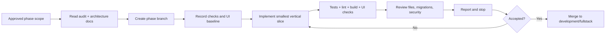

# Projex Development Workflow

## Working principles

- Development is local-first.
- The existing React/Vite JavaScript/JSX frontend is preserved.
- The planned backend is added feature by feature only after Phase 0 approval.
- Work remains cloud-provider-neutral and deployable later to a temporary VPS, GitHub Student Developer Pack credits, Azure for Students, another student cloud credit, or an SLU host.
- Student and Instructor core workflows are implemented first; Admin remains in scope through the role model and receives a dedicated later functionalization phase.
- Each phase stops when its requested scope is complete; it does not begin the next phase implicitly.

## Branch model

| Branch | Purpose |
| --- | --- |
| `main` | Stable accepted baseline. Only verified phase integrations are merged here. |
| `backup/ui-hardcoded` | Preserved hardcoded UI reference. Do not rewrite it as an active development branch. |
| `development/fullstack` | Full-stack integration branch and base for approved phase work. |
| Phase branches | Short-lived branches for one approved phase or bounded feature slice. |

Phase branches start from the current `development/fullstack` and use a clear name such as:

```text
phase/01-backend-foundation
phase/02-auth-users
phase/03-classes-membership
phase/04-activities-test-cases
phase/05-java-execution-queue
phase/06-submission-attempts-assessment
phase/07-instructor-review-feedback
phase/08-repositories-git
phase/09-admin
phase/10-integration-deployment
```

If repository policy later requires a prefix, preserve the phase identity, for example `codex/phase-02-auth-users`.

Rules:

- Do not commit directly to `main` for feature work.
- Do not merge a phase branch until its checklist, migrations, tests, lint/build, and UI regression checks pass.
- Keep `backup/ui-hardcoded` available as a visual/behavioral comparison; do not use destructive history rewriting to maintain it.
- Rebase/merge policy may be chosen by the maintainers, but shared history must not be force-pushed without explicit coordination.

## Commit discipline

- Make small, coherent commits that can be reviewed and reverted independently.
- Separate schema/migration, backend behavior, frontend adapter, and test changes when doing so keeps each commit valid.
- Do not mix formatting, CSS redesign, dependency upgrades, and feature functionalization in one commit.
- Commit messages state the outcome and feature, for example `feat(submissions): enforce one final activity submission`.
- Never commit `.env`, credentials, generated runtime storage, Java job directories, Git repositories/worktrees, logs, database dumps with private data, or build output.
- Report every changed file in the phase handoff.

## Phase workflow



For each phase:

1. Confirm branch and clean/understood worktree.
2. Read `docs/FUNCTIONALIZATION_AUDIT.md`, all files in `docs/architecture/`, and feature-relevant product docs.
3. Restate scope, protected UI, data ownership, security rules, and acceptance criteria.
4. Record baseline lint/build results and capture relevant desktop/narrow UI views before a frontend binding change.
5. Implement one end-to-end feature slice behind the existing UI.
6. Keep unrelated mocks and routes intact.
7. Add/update unit, integration, authorization, transaction, and regression tests proportional to the change.
8. Run the required checks and inspect the actual diff.
9. Report changed files, migrations, environment additions, checks, known limits, and manual test steps.
10. Stop. Do not begin the next phase without approval.

Every phase must end with a working application. An unfinished cross-phase refactor, disabled unrelated route, or partially replaced global mock layer is not an acceptable handoff.

## Frontend preservation rules

- Keep React, Vite, JavaScript/JSX, React Router, existing CSS, and current user-visible route structure.
- Do not convert the frontend to TypeScript.
- Preserve layout hierarchy, class names, spacing, responsive behavior, and current interactions unless the approved feature requires a minimal change.
- Do not redesign unrelated components.
- Do not change `src/App.css` unless the requested feature cannot be completed correctly without it. Any CSS change must be minimal and visually verified.
- Prefer JavaScript API adapters/view-model mapping so backend DTOs fit existing component expectations.
- Do not remove mocks outside the requested feature.
- When live data replaces a mock, preserve deterministic fixtures for tests and documented visual states.
- Replace data one feature and one workflow at a time; never replace all mocks in one pass.
- Verify desktop and narrow/mobile views for every touched route.

## Backend implementation rules

- Use Node.js, Express, TypeScript, Zod, Prisma ORM, and PostgreSQL.
- Follow the feature-based structure in `BACKEND_STRUCTURE.md`.
- Keep routes/controllers thin; services own rules; repositories own Prisma queries.
- Validate every boundary with Zod and enforce authorization in services/middleware.
- Use `/api/v1` and the standard response envelopes.
- Use migrations for schema changes and transactions/constraints for invariants.
- Do not use external Git or compiler APIs.
- Do not run Git or Java through shell-concatenated strings.
- Do not run Java execution in the API process.
- Use a free, self-hosted, cloud-provider-neutral initial execution queue, normally PostgreSQL job records plus a separate worker, atomic claim/lease/retry fields, bounded concurrency, and terminal states.
- Preserve immutable, server-numbered submission attempts up to activity `maxAttempts` and keep automated scores separate from instructor adjustments.
- Preserve each attempt's source, submission time, execution result, score, and review state; idempotency and database constraints must protect double-click/retry behavior.
- Keep `automatedScore` and per-test automated evidence immutable during review; record instructor adjustment and derived final score separately.
- Do not add provider-specific infrastructure without a documented, approved portability exception.

## Environment workflow

- `.env` is local/private and never committed.
- `.env.example` is committed whenever a new required variable is introduced; values are safe placeholders and descriptions.
- Local development and hosted environments have separate values and secrets.
- Environment validation fails fast at backend startup.
- Use a dedicated local/test PostgreSQL database; automated tests must not target a developer's normal data or a hosted defense database.
- Use distinct local/test roots for Git, storage, Java jobs, and temporary work.
- Commands that reset databases or delete runtime storage must verify the exact environment and target path before acting.

## Verification matrix

The exact commands are defined when backend tooling exists. At minimum, a phase must run all configured relevant checks:

| Area | Required verification |
| --- | --- |
| Frontend | Existing lint, production build, relevant route smoke tests, desktop and narrow visual inspection. |
| Backend | Type check, lint, unit tests, integration tests, production build/startup validation. |
| Database | Migration apply on a clean database, migration apply on representative prior state, constraints/transaction tests, seed test. |
| API | Response-contract, validation, authentication, authorization, pagination, error-code tests. |
| Java | Compile success/failure, timeout, memory/CPU/output limits, process-tree termination, temp cleanup, no network in hosted isolation. |
| Git | Argument/path/ref validation, bare-repo/worktree lifecycle, lock contention/recovery, unauthorized access tests. |
| Security | Secret scan/diff review, cookie/CSRF/CORS/headers, role/ownership tests, student visibility tests. |

A failing pre-existing check must be reported with evidence. New failures caused by the phase must be fixed before merge.

## Dependency changes

- Install only dependencies required by the approved phase.
- Explain why each new dependency is needed and prefer maintained, focused packages.
- Review package scripts and lockfile changes.
- Do not replace existing frontend dependencies merely to standardize the stack.
- Security-sensitive or native dependencies require extra review for hosted portability.

## Hosted deployment workflow

Deployment comes after local functionality and isolation controls pass.

- Package the frontend, API, workers, PostgreSQL connection, and persistent storage using portable configuration.
- Place a TLS reverse proxy in front of the static frontend and API.
- Keep provider-specific setup outside core feature modules.
- Configure a temporary VPS, GitHub Student Developer Pack credit, Azure for Students, another student cloud environment, or an SLU host with separate hosted secrets.
- Self-host PostgreSQL, OpenJDK/Java workers, and Git; do not make a cloud provider or Cloudflare Tunnel mandatory.
- Run migrations as a controlled release step.
- Restrict accounts/data and define the testing/defense availability window.
- Verify backup/restore, logs, worker limits, health checks, and shutdown procedure.
- Document the hosted URL and test accounts privately; never commit credentials.
- Remove or disable the temporary deployment after the approved use period.

University-wide deployment, high availability, multi-server failover, autoscaling, on-call operations, and a 24/7 SLA are out of scope.

## Codex rules

For every Codex-assisted implementation phase:

- Preserve the UI.
- Do not redesign unrelated components.
- Do not change `src/App.css` unless required by the requested feature.
- Do not remove mocks outside the requested feature.
- Do not use external Git or compiler APIs.
- Read the audit and architecture documents before changing code.
- Keep changes scoped to the requested phase and respect existing user changes.
- Report every changed file and summarize the reason.
- Run configured checks appropriate to the changed code and report results.
- Report any migration, new environment variable, manual step, limitation, or security assumption.
- Stop after the requested phase; do not continue into the next phase without explicit approval.

## Merge readiness

A phase is ready to merge into `development/fullstack` only when:

- Its checklist and acceptance criteria are complete.
- The implementation follows the architecture or documents an approved exception.
- Relevant tests, lint, type checks, builds, migrations, and manual UI checks pass.
- Security and authorization tests cover the changed resources.
- The UI remains visually equivalent except for explicitly approved functional states.
- Changed files and known limitations are reported.
- No secret or untracked runtime data is included.
