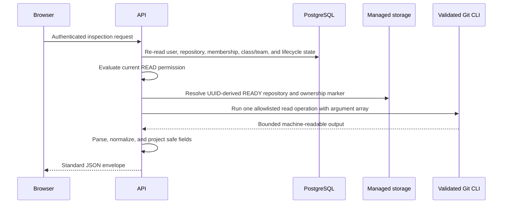

# Git Repository Inspection

## Status and scope

Phase 8C adds backend-only, authenticated, read-only inspection of READY Projex repositories. It builds on the Phase 8A managed bare-repository storage and Phase 8B authorization model without requiring Smart HTTP to be enabled. It does not modify the React frontend.

The implemented scope is deliberately limited to repository summary, branch listing, paginated commit history, reachable commit details, tree browsing, bounded UTF-8 text-file viewing, and bounded commit-to-commit diff. Empty repositories return valid empty projections rather than synthetic branches, commits, files, or activity.

No Phase 8C database migration is required. Inspection reads current repository metadata and authorization state, resolves the existing server-owned storage path, and invokes only allowlisted read-only Git commands.

## Deferred operations

Server-created branches, file commits, merges, conflict resolution, and branch deletion remain deferred. Phase 8B already provides the approved authenticated write path through protected Smart HTTP. Adding a second server-side write path would require a separately approved database-backed repository lock/lease, temporary-worktree lifecycle, author-identity policy, mutation idempotency, audit semantics, and recovery design.

Contribution summaries are also deferred. Git author names and emails are self-asserted commit metadata and cannot yet be treated as verified Projex identities or academic contribution evidence. A later analytics phase must define identity association and anti-spoofing rules before presenting contributor metrics.

Tags, notes, custom refs, submodules, Git LFS, arbitrary object access, arbitrary revision expressions, raw Git commands, binary viewing/editing, repository upload/deletion, SSH, external Git providers, CI/CD, and production exposure remain excluded.

## API contracts

All endpoints use cookie-session authentication, the `/api/v1` prefix, and the normal JSON response envelope:

```text
GET /api/v1/repositories/:repositoryId/source/summary
GET /api/v1/repositories/:repositoryId/source/branches
GET /api/v1/repositories/:repositoryId/source/commits?branchName=&page=&limit=
GET /api/v1/repositories/:repositoryId/source/commits/:commitId
GET /api/v1/repositories/:repositoryId/source/tree?branchName=&commitId=&path=
GET /api/v1/repositories/:repositoryId/source/file?branchName=&commitId=&path=
GET /api/v1/repositories/:repositoryId/source/diff?baseCommitId=&targetCommitId=&path=
```

`branchName` and `commitId` are mutually exclusive for tree/file requests. When neither is supplied, the server uses the repository's server-owned default branch. Commit IDs must be full 40-character hexadecimal object IDs and must be reachable from a current `refs/heads/*` branch. History pagination is capped at 50 commits per request.

Summary returns only safe repository-source state: repository ID, empty state, default branch, branch count, reachable commit count, and optional latest commit metadata. Branch and commit projections expose commit IDs, bounded author display names, timestamps, and bounded subjects, but never author email addresses, credentials, storage paths, Git arguments, or environment configuration.

Tree responses contain a resolved commit ID, normalized repository-relative directory path, and immediate `tree`/`blob` entries with safe object IDs and sizes. File responses contain only bounded valid UTF-8 text. Diff responses contain a bounded unified textual patch between two reachable commit IDs. Binary or invalid UTF-8 content is rejected rather than encoded or partially exposed.

## Authorization matrix

Phase 8C reuses the dynamically evaluated Phase 8 source-read rules on every request:

| Actor and current state | Inspect source |
| --- | --- |
| Active personal repository owner/member/viewer with ACTIVE repository membership | Yes |
| Active class-project lead/member with ACTIVE class, team, and repository membership | Yes |
| Owning instructor of the linked class | Yes, read-only |
| Same-class student without active team/repository membership | No |
| Removed repository/team/class member | No |
| Suspended, inactive, or setup-pending user | No |
| Administrator | No; metadata-only remains the default |
| Repository not READY or missing verified managed storage | No |
| Archived repository with otherwise valid current source authority | Yes, read-only, matching Phase 8B |

Denials use the same safe not-found posture as transport authorization where appropriate. The browser cannot obtain source access merely because it can see repository metadata.

## Request flow



## Git command boundary

The inspection adapter owns every command shape. Representative internal operations are:

- `for-each-ref` limited to `refs/heads`;
- `rev-parse --verify` only for a server-built `refs/heads/<validated-name>^{commit}`;
- `rev-list --count` for bounded history metadata;
- `log` with a fixed NUL-delimited format and pagination arguments;
- `show -s` and `diff-tree` for one reachable commit;
- `cat-file -t/-s/blob` for one validated commit/path expression;
- `ls-tree -z -l` for one reachable tree;
- `diff --no-ext-diff --no-textconv` between two reachable full commit IDs.

Clients never supply the executable, subcommand, raw arguments, filesystem path, environment, Git configuration, ref namespace, or unrestricted revision. Execution uses the validated absolute executable, `shell: false`, sanitized configuration/environment, disabled prompts/pagers/editors, process-tree timeout handling, and bounded combined output.

## Input and output limits

- Branch names use a conservative application grammar and cannot begin with a dash, contain whitespace/control characters, revision operators, `.lock` components, backslashes, or malformed separators.
- Commit IDs are exactly 40 hexadecimal characters; abbreviated IDs and expressions such as `^`, `~`, `..`, `@{}`, or `:<path>` are rejected.
- Repository paths are relative, forward-slash separated, at most 1,024 characters, and use conservative portable segments. Traversal, absolute paths, backslashes, colons/alternate streams, `.git`, trailing dots/spaces, and unsupported characters are rejected.
- Default text-file output is capped at 256 KiB.
- Default diff output is capped at 512 KiB.
- Commit details are capped at 500 changed files.
- The existing command timeout and aggregate output cap apply in addition to operation-specific limits.

Limit overflow, binary content, missing content, unavailable storage, and Git failures map to stable safe application errors. Raw stderr, process commands, host paths, and repository contents are never logged in error responses.

## Test isolation

Real-Git inspection tests run through the existing guarded `npm run test:git` boundary. They require exactly `projex_test`, an explicit non-overlapping `TEST_GIT_STORAGE_ROOT` ending in `projex_git_test`, a run-specific child, and its sentinel. Controlled commit history exists only under that child. The runner deploys committed migrations, never falls back to the normal database or normal Git root, and deletes only the verified run child.

Tests cover the complete read surface, empty repositories, strict revision/path handling, binary and size rejection, dynamic owner/member/instructor/admin boundaries, cookie authentication, safe response projections, and preservation of Phase 8A provisioning behavior.
