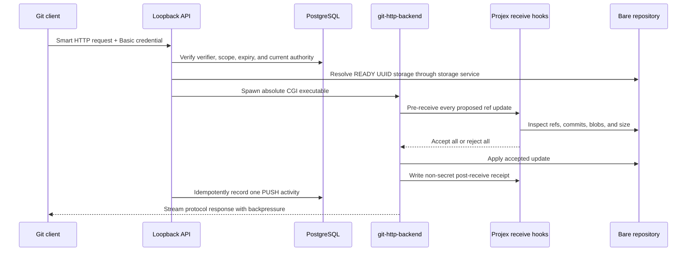

# Authenticated Git Smart HTTP Transport

## Scope and deployment boundary

Phase 8B adds backend-only authenticated Git Smart HTTP for controlled loopback development and tests. It uses the validated local `git-http-backend` executable and supports clone/fetch for authorized readers and push for authorized writers. Browsing/history/diff REST APIs are a separate read-only Phase 8C boundary documented in `GIT_REPOSITORY_INSPECTION.md`. SSH, anonymous/public access, external Git APIs, frontend integration, server-created commits, merge/conflict APIs, LFS, CI/CD, physical deletion, production deployment, and external exposure remain excluded from Phase 8B.

`GIT_SMART_HTTP_ENABLED=false` is the safe default. Enabling it requires `GIT_EXECUTION_MODE=local_process`, an absolute validated backend executable, and an API host of `127.0.0.1`, `::1`, or `localhost`. Production rejects local-process Git. Plain HTTP is permitted only on loopback; future non-loopback service requires TLS and a separate deployment review.

## Credentials

`POST /api/v1/repositories/:repositoryId/git-credentials` issues a 32-byte random repository-scoped credential for an authorized operation set. The default and maximum lifetime is 15 minutes. The response returns `username` and `secret` once. PostgreSQL stores only the credential ID, SHA-256 verifier of the high-entropy secret, user/repository binding, allowed operations, timestamps, and revocation state.

`GET /api/v1/repositories/:repositoryId/git-credentials` returns safe metadata without a secret or verifier. `POST /api/v1/git-credentials/:credentialId/revoke` explicitly revokes the caller's credential. Issuance and revocation use cookie authentication and CSRF protection. Git transport carries the credential with HTTP Basic; credentials are never included in remote URLs, repository configuration, logs, command arguments, or Git subprocess environments.

Every request rechecks the credential, expiry/revocation, user status, repository scope, operation, storage state, repository membership, class membership, team membership, lifecycle, and current time. An old credential cannot bypass a later suspension or removal.

## Authorization

| Actor/context | Clone/fetch | Feature push | `main` push |
| --- | --- | --- | --- |
| Active personal owner | Yes | Yes | Yes |
| Active personal `MEMBER` | Yes | Yes | No |
| Personal `VIEWER` | Yes | No | No |
| Active class-project lead/owner, open task | Yes | Yes | Yes through validated receive workflow |
| Active class-project team/repository member, open task | Yes | Yes | No |
| Owning class instructor | Yes | No | No |
| Same-class nonmember or removed member | No | No | No |
| Administrator | No source access by default | No | No |

Class-project writes additionally require an ACTIVE class, PUBLISHED task before its deadline, ACTIVE class/team/repository memberships, and review state `WORKING` or `CHANGES_REQUESTED`. This restrictive rule prevents source mutation after review submission or cutoff. Archived repositories remain readable to otherwise authorized readers and are never writable or physically deleted.

## Smart HTTP flow



Only these transport routes exist:

```text
GET  /api/v1/git/repositories/:repositoryId/info/refs?service=git-upload-pack
GET  /api/v1/git/repositories/:repositoryId/info/refs?service=git-receive-pack
POST /api/v1/git/repositories/:repositoryId/git-upload-pack
POST /api/v1/git/repositories/:repositoryId/git-receive-pack
```

Client filesystem paths and arbitrary CGI variables are never accepted. CGI headers are bounded before protocol streaming begins. Request and response streams use backpressure and byte counters. Timeout, limit, start, disconnect, and process failures terminate the child process tree and return safe errors.

## Push/ref policy and limits

The Projex-owned `pre-receive` hook validates all updates before any ref is accepted. Only `refs/heads/*` is supported. Tags, notes, replace refs, remotes, custom namespaces, malformed refs, `main` deletion, unauthorized `main` updates, force/non-fast-forward updates, and case-insensitive branch collisions are rejected. A multi-ref push is accepted only when every update passes.

Configurable development defaults are: repository size 100 MiB, request/received pack 25 MiB, individual blob 10 MiB, 100 branches, 50 ref updates, 200 new commits, 60-second timeout, 110 MiB response cap, and four concurrent CGI processes. These are controlled-development guardrails, not production-grade isolation.

The post-receive hook writes a request-scoped receipt only after acceptance. The API creates one unique `RepositoryActivity(PUSH)` with the user actor, repository, affected branch names, accepted update count, and timestamp. If activity persistence fails after Git accepts the push, the validated sentinel-owned receipt is retained and replayed at Smart HTTP startup or before later transport work; it is removed only after idempotent persistence succeeds. Rejected authentication and pushes create no successful activity.

Git and hook processes inherit only required OS and Git quarantine variables. Database URLs, cookies, credential material, mail secrets, authorization headers, and unrelated environment values are absent. Execution uses exact paths, argument arrays, `shell: false`, Projex-owned hooks, bounded output, and no global `safe.directory` exception.

Phase 9C permits an ACTIVE administrator to revoke an existing credential defensively, including one that is expired or belongs to an inactive user/repository. Revocation is a monotonic database compare-and-set and returns no secret/verifier. Smart HTTP resolves the credential and current authority on every request, so a credential revoked through the admin API is rejected immediately without changing repository membership or granting the administrator transport/source access.

## Test isolation

`npm run test:smart-http` requires exactly `projex_test`, explicit absolute Git/backend executables, and a guarded `TEST_GIT_STORAGE_ROOT` ending in `projex_git_test`. It builds the hook runtime, deploys committed migrations to the test database, binds an ephemeral loopback port, keeps credentials in child-process memory, and deletes only its sentinel-owned run child. It never falls back to the normal database or normal Git root.
