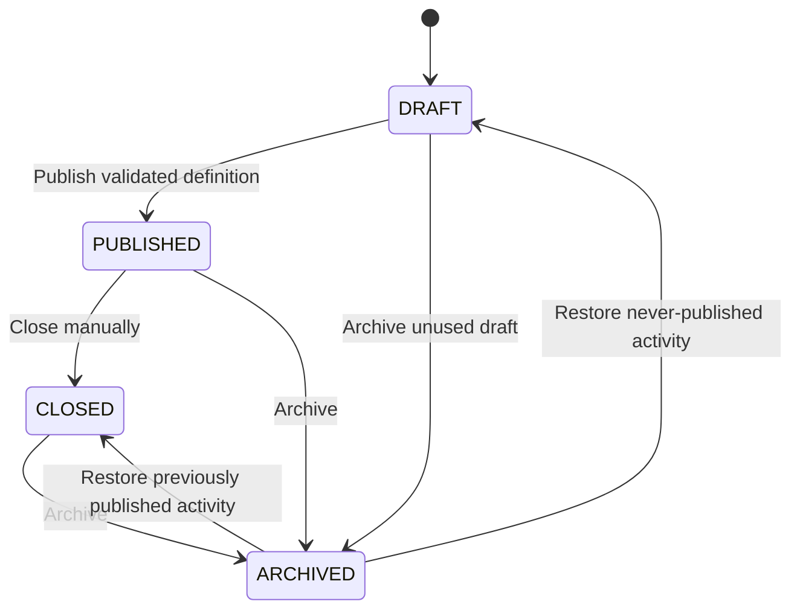

# Programming Activities and Test Cases

## Scope

Phase 5 implements backend-only programming-activity and deterministic test-case authoring. The protected React/Vite JavaScript frontend remains unchanged and continues using mocks until Phase 10.

Included:

- Draft activity creation and role-scoped listing/detail.
- Publication, manual close, archive, and safe restore.
- Java-only starter code and entry-class metadata.
- Due date, total points, one-to-three attempt configuration, and a draft-configurable `LATEST` or `HIGHEST` credited-result policy.
- Ordered visible and hidden test cases.
- Optimistic concurrency and structured lifecycle logging.

Excluded:

- Student submissions and attempt allocation.
- Java compilation, execution, workers, or external compiler APIs.
- Automated scores, score corrections, rubrics, feedback, final grades, similarity, analytics, and notifications.
- Attachments, uploads, multiple source files, scheduled publication, and automatic lifecycle jobs.
- Frontend integration or mock removal.

## Activity lifecycle



- `DRAFT` is instructor authoring state. Students cannot discover drafts. Administrators receive only the safe metadata oversight projection defined by Phase 9A.
- Publishing requires a future due date, non-empty starter code, at least one test case, at least one visible test case, positive combined test points, and combined test points no greater than `totalPoints`.
- `PUBLISHED` is student-visible to ACTIVE class members. Due state is derived from server time as `OPEN` or `PAST_DUE`; passing the deadline does not silently rewrite lifecycle state.
- Published title and instructions may be corrected. The due date may only be extended and `maxAttempts` may only increase.
- Published starter code, language, entry class, total points, credited-result policy, and test cases are immutable.
- `CLOSED` and `ARCHIVED` activities are read-only.
- Restoring a never-published activity returns it to `DRAFT`. Restoring any previously published activity returns it to `CLOSED`; restore never silently republishes or reopens work.
- An archived class rejects every activity or test-case mutation. Existing ACTIVE membership may still read published/closed activities in an archived class, consistent with the class archive policy.

## Activity fields and validation

`ProgrammingActivity.creditPolicy` is server-authoritative. New and migrated activities default to `LATEST`; an owning instructor may select `LATEST` or `HIGHEST` while the activity is `DRAFT`. Publication freezes the choice. For a one-attempt activity both policies produce the same outcome, but the stored policy remains explicit and stable.

`LATEST` credits the RELEASED submission with the greatest chronological `attemptNumber`, regardless of release timestamp. `HIGHEST` credits the RELEASED submission with the greatest `releasedFinalScore`, with the later `attemptNumber` winning an equal-score tie. Unreleased submissions never participate.

| Field | Rule |
| --- | --- |
| `title` | Trimmed, 1-200 characters. |
| `instructions` | Trimmed, 1-20,000 characters. |
| `dueDate` | ISO 8601 with offset/`Z`; must be future at publication. |
| `language` | Server-supported value `JAVA` only. |
| `entryClassName` | One Java identifier, maximum 200 characters; no path or command. |
| `starterCode` | Non-blank text, maximum 100,000 characters. |
| `maxAttempts` | Integer 1-3. |
| `totalPoints` | Positive, at most 1000, maximum two decimal places. |

The remaining portion when test-case points total less than `totalPoints` is reserved for a later approved assessment design. Phase 5 does not assign, calculate, or release that remainder.

## Test-case authoring

`PUT /api/v1/activities/:activityId/test-cases` replaces the complete draft set in one transaction.

- The request contains zero through 50 test cases. An empty draft is valid but cannot publish.
- Array position defines the authoritative one-based `testCaseOrder`; clients cannot submit an order value.
- Name is trimmed and limited to 200 characters.
- Input may be null and is limited to 32,000 characters.
- Expected output is limited to 32,000 characters and may be empty when empty output is the expected result.
- Points are non-negative, at most 1000, and use at most two decimal places.
- The combined set cannot exceed the activity total.
- Replacement touches the parent activity version before deleting/creating rows. Any failure rolls the activity version and complete child-set change back together.
- Test cases are immutable immediately after publication.

## Authorization and projections

| Action | Student | Instructor | Admin |
| --- | --- | --- | --- |
| Create/list draft activities | Denied | Owned active class | Metadata-only list for oversight; cannot create |
| List/view published or closed | ACTIVE class membership | Owned class | Metadata-only oversight projection |
| Update/publish/close/archive/restore | Denied | Owned active class | Denied |
| View all test cases | Denied | Owned class | Denied |
| View visible test cases | ACTIVE member, published/closed only | Included above | Denied through test-case endpoints |
| Replace test-case set | Denied | Owned active class, draft only | Denied |

Student test-case repositories query `isHidden = false`; filtering is not performed after loading all rows. Therefore hidden IDs, names, inputs, expected outputs, visibility flags, points, and counts never enter the student result or pagination metadata. Removed/PENDING memberships receive no activity access, including archived-class access.

Cross-class and concealed-resource failures use safe `ACTIVITY_NOT_FOUND` responses. Middleware role checks are repeated by ownership, membership, class status, and activity state checks in services/repositories.

## API surface

```text
POST  /api/v1/classes/:classId/activities
GET   /api/v1/classes/:classId/activities
GET   /api/v1/activities/:activityId
PATCH /api/v1/activities/:activityId
POST  /api/v1/activities/:activityId/publish
POST  /api/v1/activities/:activityId/close
POST  /api/v1/activities/:activityId/archive
POST  /api/v1/activities/:activityId/restore
GET   /api/v1/activities/:activityId/test-cases
PUT   /api/v1/activities/:activityId/test-cases
```

All mutations require JSON, authenticated HTTP-only-cookie session state, CSRF validation, Zod validation, and owning-instructor authorization. Activity creation always produces `DRAFT` regardless of client intent.

Activity list queries accept `page`, `pageSize`, optional `search`, and optional lifecycle `status`. Test-case lists accept `page` and `pageSize` with a maximum of 50.

Mutation bodies include `expectedUpdatedAt`. Successful writes set a version timestamp strictly later than the consumed value, including when two operations occur in the same database-millisecond. Stale requests return `409 STALE_ACTIVITY_VERSION`.

## Stable errors

- `ACTIVITY_NOT_FOUND`
- `ACTIVITY_NOT_EDITABLE`
- `ACTIVITY_NOT_PUBLISHABLE`
- `INVALID_ACTIVITY_TRANSITION`
- `PUBLISHED_ACTIVITY_FIELD_IMMUTABLE`
- `PUBLISHED_TEST_CASES_IMMUTABLE`
- `PUBLISHED_DUE_DATE_CANNOT_DECREASE`
- `PUBLISHED_ATTEMPT_LIMIT_CANNOT_DECREASE`
- `STALE_ACTIVITY_VERSION`
- `TEST_CASE_POINTS_EXCEED_TOTAL`
- Existing `CLASS_ARCHIVED`, authentication, authorization, CSRF, JSON, and validation errors.

Publication validation may return a safe machine-readable reason such as `NO_TEST_CASES` or `NO_VISIBLE_TEST_CASE`; it never returns test contents.

## Database and migration

The Phase 5 migration:

- Splits programming activities onto a dedicated PostgreSQL `activity_status` enum while leaving the project-task status type intact.
- Adds activity starter/scoring/lifecycle fields and test-case name/timestamps.
- Backfills existing rows conservatively before adding non-null/check constraints.
- Aborts if existing test order or point totals cannot be migrated safely.
- Adds database checks for attempt/point/order/text/state invariants and an activity list index.
- Runs inside an explicit transaction.

The migration never resets a database, uses `db push`, deletes academic rows, or edits prior migration history.

## Logging and sensitive data

Structured events contain actor, class, activity, and bounded count identifiers only:

- `activity.created`
- `activity.metadata_updated`
- `activity.test_cases_replaced`
- `activity.published`
- `activity.closed`
- `activity.archived`
- `activity.restored`

Request bodies, starter/source code, test-case arrays, inputs, expected outputs, hidden test values, cookies, tokens, and database URLs are not logged and are included in logger redaction paths.

## Phase 6 automated-score corrections

Published scoring configuration remains immutable, but this does not prohibit an instructor from correcting an individual automated result.

The Phase 6 professor-facing workflow may use the label `Edit Automated Score`. Its append-only persistence model retains, rather than overwrites:

- The original automated result and points.
- The previous and new effective automated score.
- A required correction reason.
- The correcting instructor identity.
- The correction timestamp.

Phase 5 implemented none of those behaviors; Phase 6 implements them while leaving the published Phase 5 configuration immutable.

## Verification

The isolated suite covers activity authorization, projection, lifecycle policy, publication failures, immutable published fields, monotonic versions, and hidden-test-safe logging. The guarded serial PostgreSQL suite covers persistence, filtering, ownership/membership boundaries, publication validation, role-specific test projections, concurrent stale-write rejection, transactional replacement rollback, lifecycle restoration, and SQL constraints.

`npm run test:integration` accepts only exactly `projex_test`, applies committed migrations with `prisma migrate deploy`, runs serially, and removes fixture application rows while preserving migration history. It covers the persisted policy default/selection, draft mutability, publication immutability, exact-deadline boundary, and credited-attempt selection. It never falls back to the normal development database and never uses `prisma db push` or `prisma migrate reset`.
