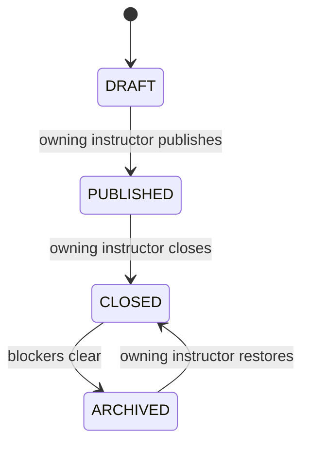
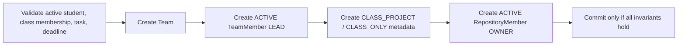
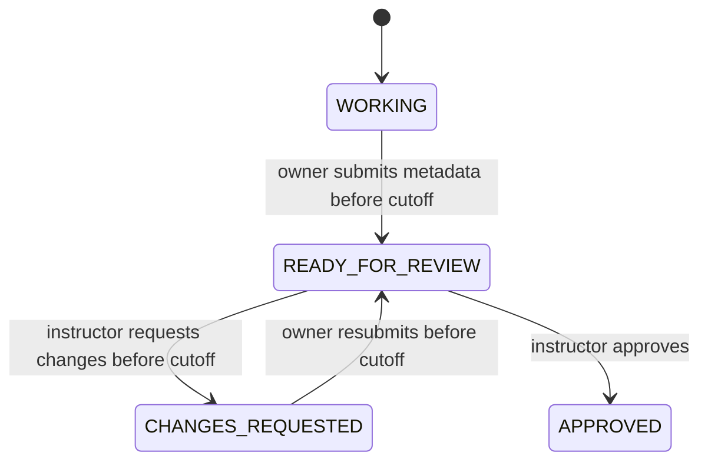

# Project and Repository Collaboration

## Scope

This document is the authoritative Phase 7 backend contract for instructor-created project tasks, student-created repository metadata, teams, synchronized collaborators, invitations, textual project feedback, review lifecycle, monitoring, and archive protection.

Phase 7 does not modify the React frontend, provision repositories on disk, invoke Git, create commits or branches, calculate project grades, implement rubrics, transfer ownership, send invitation email, or populate `RepositoryActivity`. Those capabilities require later separately approved phases.

## Server-owned repository types

| Type | Required context | Visibility | Phase 7 behavior |
| --- | --- | --- | --- |
| `CLASS_PROJECT` | One project task and one team | `CLASS_ONLY` | Academic collaboration and instructor review metadata. |
| `PERSONAL` | No project task or team | `PRIVATE` | Owner-only metadata workspace. |

Clients cannot submit or mutate visibility, owner identity, project/class linkage, team identity, storage paths, default branch, review authority, or Git fields. `PUBLIC` is rejected. `storagePath` remains null until Phase 8 provisions server-owned storage.

## Project-task lifecycle



- Creation always produces `DRAFT`.
- Only the exact ACTIVE instructor who owns the class may create or mutate a task. Administrators receive safe read-only access.
- Draft metadata is editable with optimistic concurrency. Publication requires a future due date.
- Student access requires ACTIVE class membership and a `PUBLISHED` or `CLOSED` task.
- `CLOSED` rejects new student collaboration mutations but retains instructor review/monitoring access.
- `ARCHIVED` is read-only. Restore returns to `CLOSED`; it never silently republishes or reopens the task.

## Team and repository lifecycle

Creating a class-project repository is one serializable transaction:



- One team owns one class-project repository, and one class-project repository belongs to one team.
- A student may be ACTIVE on at most one team for a project task.
- The owner counts toward `maxTeamSize` and is both the ACTIVE team `LEAD` and ACTIVE repository `OWNER`.
- The lead/owner cannot leave or be removed. Ownership transfer is a known Phase 7 limitation and cannot be simulated by instructor intervention.
- Team and repository membership status remains synchronized as `ACTIVE` or `REMOVED`.
- Removal preserves both membership rows and timestamps. Reactivation reuses both rows; it does not create a second membership history row.
- Repository membership alone never creates academic team membership or class membership.

Repository review states are:



- `READY_FOR_REVIEW` means repository metadata was formally submitted for instructor review.
- `REQUEST_CHANGES` is allowed only while the task is `PUBLISHED`, before its deadline, and from `READY_FOR_REVIEW`.
- After the deadline or while `CLOSED`, the instructor may approve previously submitted `READY_FOR_REVIEW` work but cannot request changes.
- There is no Phase 7 late-revision window. A future post-deadline revision requires a separately approved server-controlled workflow.
- Students cannot resubmit, reopen review, edit metadata, change membership, or act on ordinary invitations after cutoff.
- Numeric project grades, rubrics, and final-grade calculation remain out of scope.

## Invitations

An ordinary invitation requires all of the following at the authoritative transaction:

- The caller is the ACTIVE team lead/repository owner.
- The class and repository are active and the task is `PUBLISHED` before its deadline.
- The invitee is an ACTIVE user with role `STUDENT` and ACTIVE membership in the same class.
- The invitee is not an ACTIVE member of any team for the same project task.
- The invitee is not already an ACTIVE member of this repository.
- No unexpired PENDING invitation already exists for the invitee/project task.
- ACTIVE team members plus unexpired PENDING invitations remain within `maxTeamSize`.

Expiry is `min(createdAt + 7 days, projectTask.dueDate)`. Reads may project an elapsed PENDING invitation as expired; mutation paths persist `EXPIRED` transactionally. No background scheduler is required.

Acceptance locks and validates the invitation, then creates or reactivates both `TeamMember` and `RepositoryMember` and marks the invitation `ACCEPTED` in one transaction. Decline and ordinary owner revoke are available only before cutoff. The owning instructor may revoke an otherwise blocking invitation after cutoff only as a reasoned corrective action.

## Feedback and review coupling

- Only the exact class owner may create or update textual feedback drafts.
- Draft updates require `expectedUpdatedAt`.
- Students and classmates never receive drafts.
- `REQUEST_CHANGES` requires a non-empty current draft and atomically changes it to `RELEASED` while moving the repository to `CHANGES_REQUESTED`.
- `APPROVE` may release an optional current draft atomically while moving the repository to `APPROVED`.
- Released feedback retains instructor/releaser identity and timestamps.
- Phase 7 does not accept or return the legacy optional numeric repository grade field.

## Authorization matrix

| Action | Student | Owning instructor | Other instructor | Admin |
| --- | --- | --- | --- | --- |
| Create/update/lifecycle project task | No | Yes | Concealed | Read-only |
| View project task | ACTIVE same-class member | Yes | Concealed | Yes, safe projection |
| Create class-project repository | Eligible ACTIVE student | No | No | No |
| Create/view personal repository | Owner only | No | No | Safe read-only listing/detail |
| View class-project metadata | ACTIVE same-class member, except an explicitly REMOVED repository member | Yes | Concealed | Yes, safe projection |
| Edit repository metadata | Owner, before cutoff | No | No | No |
| Create ordinary invitation | Owner, before cutoff | No | No | No |
| Accept/decline received invitation | Invitee, before cutoff | No | No | No |
| Remove/reactivate member | Owner before cutoff, never lead | Corrective after cutoff with reason; never lead | Concealed | No |
| Submit/resubmit for review | Owner before cutoff | No | No | No |
| Draft feedback | No | Yes | Concealed | No |
| Request changes | No | Yes, before cutoff only | Concealed | No |
| Approve submitted review work | No | Yes, including after cutoff/CLOSED | Concealed | No |
| View feedback | Released only | Draft and released | Concealed | Released safe view only |
| View monitoring/teams | ACTIVE same-class member receives non-sensitive team summary | Yes | Concealed | Yes, safe summary |
| Archive/restore class-project records | No | Yes when gates pass | Concealed | No Phase 7 mutation |

Inactive users and REMOVED class members fail all student collaboration checks. Protected cross-class resources normally return a safe not-found response.

## API contracts

All endpoints use `/api/v1`, cookie authentication, CSRF protection for mutations, strict Zod validation, standard envelopes, and request IDs.

### Project tasks

```text
POST  /classes/:classId/project-tasks
GET   /classes/:classId/project-tasks
GET   /project-tasks/:projectTaskId
PATCH /project-tasks/:projectTaskId
POST  /project-tasks/:projectTaskId/publish
POST  /project-tasks/:projectTaskId/close
POST  /project-tasks/:projectTaskId/archive
POST  /project-tasks/:projectTaskId/restore
GET   /project-tasks/:projectTaskId/teams
GET   /project-tasks/:projectTaskId/monitoring
```

Creation accepts `title`, `instructions`, `dueDate`, and `maxTeamSize` (2 through 8). Updates/lifecycle mutations accept `expectedUpdatedAt` and only the documented editable fields.

### Repositories and review

```text
POST  /project-tasks/:projectTaskId/repositories
POST  /repositories/personal
GET   /repositories
GET   /repositories/:repositoryId
PATCH /repositories/:repositoryId
POST  /repositories/:repositoryId/ready-for-review
POST  /repositories/:repositoryId/request-changes
POST  /repositories/:repositoryId/approve
POST  /repositories/:repositoryId/archive
POST  /repositories/:repositoryId/restore
```

Class-project creation accepts `teamName`, `repositoryName`, and optional `description`. Personal creation accepts `repositoryName` and optional `description`. Optimistically locked transitions accept `expectedUpdatedAt`; request/approval may additionally reference a current feedback draft version.

### Members, invitations, and feedback

```text
GET   /repositories/:repositoryId/members
PATCH /repositories/:repositoryId/members/:memberId
POST  /repositories/:repositoryId/invitations
GET   /repositories/:repositoryId/invitations
GET   /repository-invitations
POST  /repository-invitations/:invitationId/accept
POST  /repository-invitations/:invitationId/decline
POST  /repository-invitations/:invitationId/revoke
GET   /repositories/:repositoryId/feedback
POST  /repositories/:repositoryId/feedback-drafts
PATCH /repository-feedback/:feedbackId
```

Membership changes accept `REMOVE` or `REACTIVATE`, `expectedUpdatedAt`, and a reason when the owning instructor acts after cutoff. The owner member projection includes only the membership status and version needed for those actions in addition to the basic roster fields; it still omits email and account status. The service logs whether the mandatory reason exists without logging its text.

## Archive gates

A class-project repository archives only when it is `APPROVED`, has no unexpired PENDING invitation, and membership invariants hold. Its team archives atomically.

A project task archives only from `CLOSED` when:

- no unexpired PENDING invitation exists;
- every class-project repository is `APPROVED` or already `ARCHIVED`; and
- no team/repository membership or owner/lead invariant is broken.

Class archive enforces the same Phase 7 blockers in addition to prior activity/submission blockers. Expired invitations do not block archive. Archived tasks, teams, and repositories are read-only; restoring a task produces `CLOSED` and restoring a repository never reopens student collaboration while the task remains closed.

## Database and concurrency controls

- UUID keys, snake-case database names, `timestamptz(3)`, explicit foreign keys, and archive/history conventions continue.
- Composite foreign keys bind team/repository/invitation records to the same project task.
- Check constraints bind repository type to project/team presence and server visibility.
- Partial unique indexes protect one active lead, one active owner, one active team per student/task, and one pending invitation per invitee/task.
- Serializable transactions and row locks protect project/team capacity and conflicting membership writes.
- Deferred constraint triggers validate the full synchronized membership and owner/lead invariant at commit, permitting correct multi-row transactions while rejecting partial writes.
- Optimistic concurrency timestamps reject stale metadata, lifecycle, review, membership, and feedback changes.

## Verification strategy

The isolated suite remains `npm test`. Real PostgreSQL behavior runs serially through `npm run test:integration`; the runner accepts only an explicitly recognized `projex_test`, deploys committed migrations, never falls back to `DATABASE_URL`, and performs dependency-ordered fixture cleanup while preserving Prisma migration history.

Phase 7 database-backed coverage includes:

- project-task persistence, filtering, pagination, role scope, lifecycle, and optimistic concurrency;
- server-controlled visibility, safe projections, personal ownership, and cross-class concealment;
- atomic team/repository/owner creation and concurrent uniqueness protection;
- invitation eligibility, duplicate/conflicting-team rules, expiry, capacity, acceptance, decline/revoke restrictions, and transaction rollback;
- synchronized membership removal/reactivation, owner immutability, and database-trigger rejection of partial writes;
- deadline/CLOSED restrictions and mandatory reasoned instructor correction;
- feedback draft visibility, optimistic concurrency, atomic request-changes release, and approval after cutoff;
- repository/project-task/class archive blockers;
- cookie authentication, CSRF, strict request validation, response envelopes, and request IDs through actual Express routes; and
- confirmation that no `RepositoryActivity` or filesystem/Git work is generated.

The committed migration is verified against `projex_test` before explicit approval to deploy it to the normal development database. Live role verification follows only after the normal database migration is approved and applied.

## Deferred work and limitations

- Local Git CLI, bare repositories, worktrees, branches, commits, clone/push/pull, diff/history, and contribution metrics: Phase 8.
- Ownership/team-lead transfer and member self-leave: separately approved future workflow.
- Post-deadline revision windows: separately approved server-controlled workflow.
- Numeric project grades, rubrics, and final-grade calculation: later grading scope.
- Durable administrative audit-event table and notifications: later hardening/features. Structured security/operational logs remain required now.
