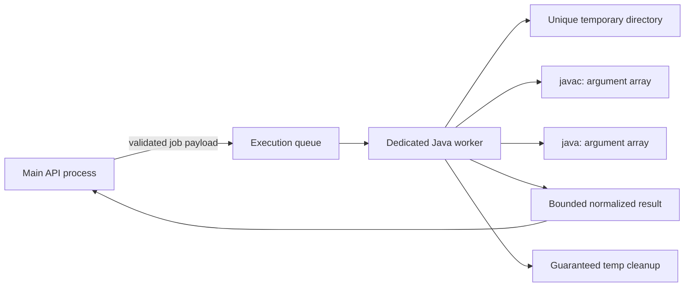

# Projex Security Rules

## Security posture

Projex handles academic identities, source code, hidden tests, submissions, grades, feedback, repository history, and instructor-only review signals. The browser and all client-supplied values are untrusted. Security controls belong in the backend and infrastructure boundaries, not only in hidden buttons or routes.

The hosted target is a controlled testing/defense environment, but internet accessibility still requires production-style authentication, transport security, input validation, isolation, logging, and patch discipline.

## Authentication

- Use server-side secure sessions identified by a high-entropy opaque session cookie.
- Set cookies `HttpOnly`, `Secure` in HTTPS environments, and `SameSite=Lax` by default. Scope path/domain narrowly.
- Store only a session identifier in the cookie; store principal/session state server-side.
- Store a hash of the session token where practical so a database read does not expose usable active tokens.
- Rotate the session ID after login and privilege changes to prevent session fixation.
- Revoke the server session on logout, account disablement, password reset, or administrative security action.
- Apply absolute and idle expiry. Hosted sessions should be short enough for a controlled defense environment.
- Hash passwords with a current password-hashing algorithm and calibrated work factor; never encrypt or store plaintext passwords.
- Rate-limit login and sensitive recovery actions without revealing whether a particular account exists.
- Do not store session tokens in `localStorage`, `sessionStorage`, URLs, logs, or frontend source.
- Protect cookie-authenticated state-changing requests against CSRF using an application CSRF token strategy plus SameSite controls.

## Authorization

- Never trust roles, user IDs, owner IDs, class IDs, or permissions sent by the frontend.
- Resolve the authenticated principal and roles from the server-side session on every protected request.
- Apply coarse role checks and resource-specific checks. A valid instructor role alone does not grant access to every class.
- Verify class membership, instructor assignment, repository membership, team membership, record ownership, and lifecycle state as required by the use case.
- Admin actions require explicit admin authorization and an audit trail; admin does not imply bypassing data-minimization rules.
- Use deny-by-default endpoint policies.
- Prefer `404` when revealing that a protected resource exists would disclose private information; otherwise return `403`.

Minimum policy examples:

| Action | Required checks |
| --- | --- |
| Student views activity | Authenticated student, active class membership, activity visible/published. |
| Student submits | Same as view plus activity accepting submissions, backend-calculated next attempt, and existing attempt count below `maxAttempts`. |
| Instructor views submission | Authenticated instructor assigned to the submission's class, or explicit authorized admin workflow. |
| Instructor releases feedback | Assigned instructor, valid review state, grade/feedback validation, transaction. |
| Repository read/write | Class/project visibility plus repository membership/role and archive/read-only state. |
| Detailed similarity review | Assigned instructor or narrowly authorized admin; never student payload. |
| Student views class/roster | Authenticated ACTIVE student and ACTIVE membership; roster projection contains only user ID and full name. |
| Instructor manages class | Authenticated ACTIVE instructor who owns that exact class; archived classes are read-only. |
| Admin manages class | Authenticated ACTIVE admin; admin-created classes require an existing ACTIVE instructor. |
| Student joins class | Authenticated ACTIVE student, valid active server-generated code, active class, and no REMOVED/PENDING membership. |

Projex defines the roles `STUDENT`, `INSTRUCTOR`, and `ADMIN` from the first authentication schema. Student and Instructor workflows are implemented first, but Admin remains in scope and the existing admin prototype is preserved for a dedicated later phase. Admin access remains explicit, authorized, minimized, and audited.

## Data visibility

- Students may receive visible test summaries but never hidden test inputs, expected outputs, source logic, or worker-only test files.
- Students may receive general academic review labels such as `under_review`, `needs_instructor_review`, or `checked` but never exact similarity scores, matched classmates, matched files, or side-by-side comparisons.
- Grade and feedback drafts are instructor-only until explicitly released.
- Repository clone/download/file APIs enforce membership and visibility on every request.
- API serializers use explicit field selections for each role. Sending sensitive fields and hiding them with CSS is prohibited.
- Logs and analytics must minimize personal and source-code data.
- Class join codes are capability values. Generate them cryptographically, omit ambiguous characters, normalize before lookup, exclude them from student responses, and never place generated or submitted codes in logs or error details.
- Removed class membership grants no active or archived class, roster, activity, or related student access.

## Submission and assessment integrity

- Activities permit 1 through 3 attempts. The backend atomically enforces the activity limit and assigns `attemptNumber`; the frontend cannot choose it.
- Each successfully created attempt is immutable and its source snapshot, submitted timestamp, late/status values, execution result, score, and review state remain preserved.
- Idempotency and uniqueness on activity, student, and attempt number prevent double-clicks or retries from creating accidental attempts.
- Deterministic test execution produces `automatedScore` and per-test `automatedPoints`; instructor review never overwrites them.
- Instructor changes are stored separately as `instructorAdjustment` and, when enabled, `instructorAdjustedPoints`; `finalScore` is derived within the activity's total points.
- Review and feedback-release timestamps are recorded, and unreleased drafts remain instructor-only.

## Input, HTTP, and application security

- Validate params, query, body, file metadata, environment variables, and job payloads with Zod.
- Enforce request size, upload count, filename, extension, MIME, source, stdin, and output limits.
- Reject path traversal, NUL bytes, unsafe Unicode/control characters, and unsupported encodings where relevant.
- Use parameterized Prisma queries. Raw SQL requires review, parameter binding, and a documented reason.
- Configure secure HTTP headers and a Content Security Policy compatible with the existing frontend.
- Restrict CORS to known hosted origins; do not use wildcard credentials.
- Rate-limit login, submissions, compilation, repository mutations, invitations, downloads, and administrative actions.
- Centralize safe error handling; never return stack traces, SQL, process commands, environment values, or host paths.
- Keep dependencies patched and review lockfile changes.

## Local Java execution boundary

Core Java checking must not use an external compiler API.

The server uses a locally managed OpenJDK toolchain. A temporary hosted environment also self-hosts its Java runtime and workers.

### Accepted client inputs

- Java source files/content within configured count and byte limits.
- Standard input (`stdin`) within a configured byte limit.
- A server-selected activity/test-case identifier.

Clients must never submit a shell command, executable path, JVM flag, compiler flag, classpath, host path, timeout, memory limit, CPU limit, test visibility, or arbitrary environment variable.

### Required execution design

- Never compile or execute untrusted Java in the main API process.
- Compile once per final submission assessment. Run the resulting classes against the required test inputs without recompiling for each test.
- All work enters a dedicated execution queue with bounded concurrency and per-user/activity rate limits. The initial queue may be PostgreSQL-backed and processed by a separate worker; Redis, RabbitMQ, or another external queue product is not required.
- Use process spawning with executable plus argument arrays; never construct shell command strings.
- Run with a minimal environment and no inherited secrets.
- Use a unique server-created temporary directory per job under an approved execution root.
- Canonicalize and verify every path remains under the job root; reject symlinks or unsafe file layouts as appropriate.
- Set separate compile timeout and execution timeout, memory limit, CPU quota/time, process-count/thread limit, file-size/disk limit, and stdout/stderr/output-size limits.
- Kill the entire process tree/container when a limit is reached.
- Truncate or terminate on output overflow and return a stable `output_limit_exceeded` result.
- Disable network access for execution workers.
- Restrict filesystem access to the job directory and required read-only runtime files.
- Do not run as root. Use a dedicated low-privilege OS identity.
- Always clean temporary directories after success, failure, timeout, and worker restart recovery.
- Persist only the bounded result and required source snapshot; do not retain arbitrary runtime files.
- Return a safe normalized execution result; never expose host paths, raw process commands, hidden tests, or worker internals.
- Add Docker/container isolation in the hosted phase. Container isolation is defense-in-depth, not permission to relax validation or limits.

Until safe isolation is implemented and verified, Java execution must remain disabled outside an explicitly controlled local development setup.

## Local Git boundary

Core repository behavior must not use GitHub or GitLab APIs.

### Repository storage model

- Store canonical repositories as bare Git repositories under a server-owned root.
- Store only server-generated relative repository identifiers in the database.
- Create temporary worktrees for file operations that require a working tree; remove them after use.
- Never accept an absolute repository/worktree path from the client.
- Canonicalize and verify all paths stay within the configured Git/storage roots.
- Run Git as a dedicated low-privilege service identity.
- Preserve commit, branch, diff, and contribution history required for the academic record.

### Command execution

- Invoke the Git executable directly with a fixed executable and argument array.
- Never use shell string concatenation, `exec` with a shell, user-provided subcommands, aliases, hooks, or arbitrary config flags.
- Each operation has an allowlisted implementation, for example a service method for list branches or create commit.
- Use `--` before path operands where Git supports it.
- Control environment variables, disable interactive prompts, and avoid reading user/global Git configuration.
- Disable or control hooks and external helpers. Hosted workers must not invoke arbitrary credential helpers, pagers, editors, filters, or diff drivers.
- Bound process time and captured output.

### Names, paths, and concurrency

- Validate repository names and branch/tag names with explicit application rules; use `git check-ref-format` for refs. Reject control characters, ambiguity, leading dashes, reserved names, separators/path traversal, and excessive length.
- Validate file paths as normalized repository-relative paths; prevent traversal, `.git` manipulation, symlink escape, and unsafe special files.
- Apply a per-repository write lock/lease around operations that change refs, index/worktrees, membership-dependent snapshots, or archive state.
- Reads may run concurrently only when Git and application consistency allow it.
- Recover stale locks using explicit lease ownership and timeout rules; never delete an active lock blindly.
- Record security-relevant mutation metadata without logging full private source contents.

## Storage security

- Define separate server-owned roots for Git repositories, attachments, Java jobs, exports, and temporary files.
- Hosted persistent roots must not be inside the public web root.
- Generate stored filenames/keys server-side; retain original names only as metadata after sanitization.
- Apply per-file and aggregate quotas.
- Downloads use authorized endpoints or short-lived server-issued access, not raw filesystem URLs.
- Temporary files have cleanup schedules and startup recovery.
- Backups and exports inherit the same access controls as their source data.

## Secrets and environment variables

- `.env` is never committed.
- `.env.example` is committed and contains variable names plus safe placeholders only.
- No secret, real password, cookie key, database credential, host private key, or token appears in source code, documentation examples, fixtures, logs, or client bundles.
- Local development variables and hosted variables are maintained separately.
- Hosted secrets are injected by the host/process/container configuration, not copied from a developer `.env`.
- Validate environment variables at startup with Zod and fail closed on missing/invalid security settings.
- Rotate any secret suspected of exposure; changing the Git history alone does not revoke it.

Expected categories include database URL, session secret/key material, allowed origin, public base URL, storage roots, Git executable/root, Java worker configuration, queue settings, logging level, and resource limits. Exact secret values are never committed.

## Logging, auditing, and incident handling

- Use structured logs with request/job correlation IDs and UTC timestamps.
- Record authentication events, role/account changes, class membership changes, submissions, grade/feedback release, repository membership/mutations, archive/restore, and administrative actions.
- Redact cookies, session tokens, CSRF tokens, passwords, connection strings, full source code, stdin, hidden tests, and sensitive feedback.
- Protect logs from student access and bound retention/storage.
- Hosted testing needs a documented way to disable accounts, revoke sessions, stop workers, take the service offline, and preserve relevant logs after an incident.

## Hosted testing rules

- Use HTTPS and a controlled domain/address.
- Create only required test/defense accounts and least-privilege roles.
- Do not import unnecessary real student records.
- Limit the availability window where practical and remove/disable the deployment after the approved period.
- Apply OS, Node, PostgreSQL, Git, Java, and container security updates before exposure.
- Back up defense-critical data and test restoration.
- Internet accessibility does not change scope: university-wide deployment and 24/7 availability remain out of scope.
- Deployment stays portable and may use a temporary VPS, GitHub Student Developer Pack credits, Azure for Students, another student cloud credit, or an SLU-provided host. PostgreSQL, OpenJDK/Java, and Git remain self-hosted; no provider or Cloudflare Tunnel is mandatory.
- High availability and multi-server failover are out of scope for the controlled pilot.
