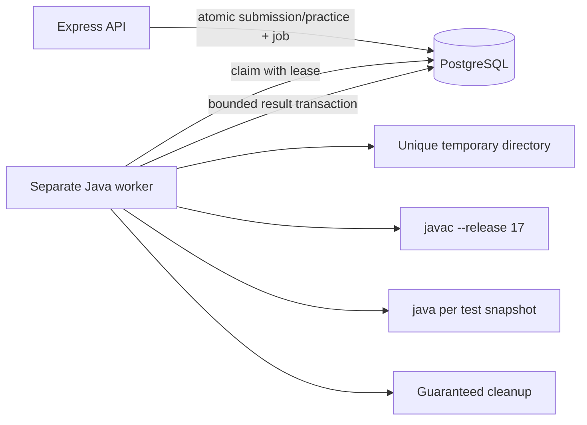
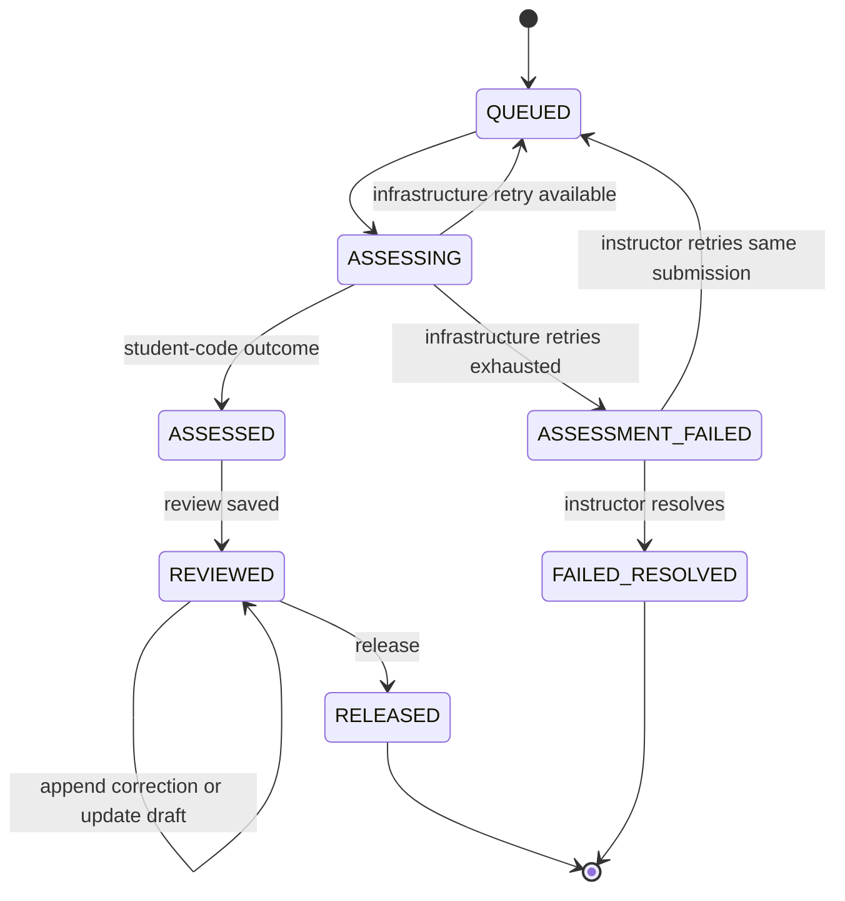

# Projex Submissions and Automated Assessment

## Status and scope

This document records the Phase 6 submission/assessment contract and the bounded Iteration 2 Instructor review-rerun extension. The original submission, score, and release contract remains unchanged.

Phase 6 does not integrate the frontend, calculate course grades, implement rubrics or similarity analysis, permit post-release correction/versioning, execute Java on an internet-accessible host, or begin project/repository work.

## Execution boundary

- `JAVA_EXECUTION_MODE=disabled` is the safe default.
- `local_process` is accepted only when `NODE_ENV` is not `production` and only for controlled local verification/demonstration.
- The API process never invokes `javac` or `java`. It persists a durable job; a separate worker claims and executes it.
- The worker invokes executables with argument arrays and `shell: false`, compiles with `--release 17`, uses a unique server-created temporary directory, compiles once per job, bounds time/output, applies a JVM heap limit, kills the process tree on a limit, and removes the directory afterward.
- Instructor review reruns use that same separate worker and runner, with their own durable `INSTRUCTOR_REVIEW_RUN` job target. They never reuse the official assessment job or Student practice record.
- Client payloads cannot select commands, executables, flags, paths, environment variables, test visibility, test inputs, or limits.
- Phase 6 local-process controls are not a complete hostile-code sandbox. Container or equivalent CPU, process, network, and filesystem isolation is required before internet-hosted Java execution is enabled.



## Official submission creation

`POST /api/v1/activities/:activityId/submissions` accepts only:

```json
{
  "sourceCode": "public class Main { ... }"
}
```

The request requires a validated `Idempotency-Key` header, cookie authentication, CSRF protection, an ACTIVE student account, ACTIVE membership, an ACTIVE class, and enabled controlled-local execution.

The serializable creation transaction:

1. Acquires the student/activity allocation lock and share-locks the activity/class against archive.
2. Rechecks the authoritative user, membership, class, activity, deadline, counting-attempt allowance, and replacement state.
3. Applies idempotency within authenticated student + activity + submission endpoint scope.
4. Allocates the next positive chronological `attemptNumber`.
5. Creates immutable source/activity/test snapshots, one execution, per-test result placeholders, one durable job, and one idempotency record.
6. When applicable, consumes and links exactly one valid replacement grant in the same transaction.

A new attempt returns `201`. An exact replay returns the original response with `200` and `meta.idempotentReplay=true`. Reusing the same scoped key with different source returns `DUPLICATE_SUBMISSION_REQUEST`. Another student has a separate scope.

## Attempt allowance and replacement grants

- `maxAttempts` is 1 through 3 and limits records where `countsTowardAttemptLimit=true`.
- `attemptNumber` is chronological internal history, not the allowance count.
- Student compilation errors, test failures, runtime errors, student-code timeout, and output overflow count toward the allowance.
- Worker/runtime unavailability, worker crashes, lease-recovery exhaustion, temporary-directory failures, and internal worker failures are infrastructure failures.
- Infrastructure retries always use the original immutable submission and job first.
- Exhausted infrastructure failures remain counting and `ASSESSMENT_FAILED` until an owning instructor explicitly resolves them.
- `CLOSED_WITHOUT_REPLACEMENT` preserves a counting terminal `FAILED_RESOLVED` record.
- `REPLACEMENT_GRANTED` preserves the failed record, sets it non-counting, requires a mandatory reason and future `replacementExpiresAt`, and creates no replacement until the student consumes the grant.
- A replacement is usable once, before expiration. It may cross the normal deadline or `CLOSED` state but never an archived class/activity, inactive account, or removed membership.
- An expired unused grant cannot be consumed. It remains immutable evidence and no longer blocks archive.
- The API labels the linked record `Replacement attempt for Attempt N`; clients must not display “Attempt N of maxAttempts” for a replacement.



## Scoring and release

- `automatedMaximum = sum(testCase.maximumPoints)`.
- `instructorMaximum = totalPointsSnapshot - automatedMaximum`.
- `originalAutomatedScore = sum(original per-test automatedPoints)` and is immutable.
- `effectiveAutomatedScore` is the latest correction value, or the original score when no correction exists, and remains within `0..automatedMaximum`.
- `instructorPoints` remains within `0..instructorMaximum`.
- `finalScore = effectiveAutomatedScore + instructorPoints` and remains within `0..totalPointsSnapshot`.
- Release snapshots `releasedFinalScore` and makes the submission immutable during Phase 6.

Every score correction is append-only and preserves correction order, original automated score, previous effective score, new effective score, mandatory reason, instructor identity, and timestamp.

### Credited released result

The activity's immutable `creditPolicy` selects one credited result from RELEASED submissions only:

- `LATEST` selects the greatest chronological `attemptNumber`; release timestamp ordering is irrelevant.
- `HIGHEST` selects the greatest `releasedFinalScore`; an equal-score tie selects the greater `attemptNumber`.
- A RELEASED replacement participates normally and keeps the label `Replacement attempt for Attempt N`. Its failed predecessor does not participate unless it is independently RELEASED.
- An unreleased attempt never affects the current credited result and no unreleased score is implied to a student.

The selection is derived from authoritative records rather than stored as a mutable pointer. Submission detail/list projections carry the backend-calculated `isCreditedResult`; clients must not recalculate it from a page of results.

### Student attempt state

`GET /api/v1/activities/:activityId/attempt-state` is a student-only, read-only submissions projection. It reports lifecycle/due state, `maxAttempts`, counting attempts used, remaining ordinary attempts, credit policy, ordinary eligibility, replacement availability, next allowed submission kind, a safe blocked reason, released-attempt summaries, and the credited-result summary.

Allowance uses `countsTowardAttemptLimit`, never chronological `attemptNumber`. An active replacement has priority over an ordinary attempt. Execution-disabled mode reports no next allowed submission while preserving truthful replacement availability. The endpoint uses explicit safe selects and omits source, hidden-test data/counts, unreleased scores, correction history/reasons, draft feedback, and worker/job information.

The projection is observational. Official submission creation remains the concurrency-safe authority and rechecks account, membership, class, activity, exact deadline (`now >= dueDate` is closed), allowance, replacement, execution availability, idempotency, and chronological allocation inside its established transaction.

## Visibility and authorization

| Capability | Student | Owning instructor | Admin |
| --- | --- | --- | --- |
| Create official attempt | Own ACTIVE membership only | No | No |
| Run visible tests | Own ACTIVE membership only | No | No |
| List/get official submissions | Own records only | Owned class | Safe read-only projection |
| View source | Own record | Owned class | No |
| View visible outcomes immediately | Own record | Yes | Summary only |
| View hidden evidence | Never | Owned class | No |
| Correct/review/release | No | Owned class, unarchived state | No |
| Retry/resolve infrastructure failure | No | Owned class, unarchived state | No |
| Start/read fresh review rerun | No | Owned class, unarchived start; historical read after archive | No |

Before release, students receive visible-test outcomes but no numeric scores, corrections, instructor points, final score, or feedback. After release they may receive the released final score, total points, and released feedback. Students never receive hidden-test inputs, expected outputs, identifiers, names, individual outcomes, points, or counts.

Java output comparison first normalizes CRLF and CR line endings to LF. Exact normalized output passes. For non-empty output, the server also accepts a single terminal LF on exactly one side, covering the ordinary `println` newline without trimming any other whitespace. Empty output remains different from a blank line; leading and trailing spaces, per-line trailing spaces, internal spacing and blank lines, and multiple terminal newlines remain significant. Failed visible-test outcomes may include their already student-visible expected-output snapshot and use explicit space, tab, and line-ending markers in the client. Hidden-test expected output and breakdown remain omitted.

## Run Visible Tests

`POST /api/v1/activities/:activityId/visible-test-runs` accepts Java source only. It rejects arbitrary stdin and requires the normal student/account/membership/class/activity/deadline checks.

The transaction snapshots only `isHidden=false` test cases and creates a short-lived `PracticeExecution`, visible-case records, and durable `VISIBLE_TEST_RUN` job. It does not create an `ActivitySubmission`, attempt number, idempotency record, score, feedback, or official history.

Creation is protected by a per-student rate limit and per-student/activity active-job capacity. `GET /api/v1/visible-test-runs/:runId` returns only the owning student's result or the owning instructor's result. Phase 9A removes administrator access to individual practice-run outcomes.

## Instructor review rerun (Iteration 2)

`POST /api/v1/submissions/:submissionId/review-runs` accepts an empty JSON object. It requires an ACTIVE owning Instructor, cookie authentication, CSRF, controlled local Java execution, and an unarchived activity/class. The request does not accept source, stdin, test selection, paths, or execution limits. One active review run per Instructor and at most ten requests per rolling minute bound use. A CLOSED activity and a RELEASED submission may still be rerun; archive blocks new work.

The transaction copies the original submission's saved test-case input/expected-output snapshots into a separate `ReviewExecution` and cases, then creates one `ExecutionJob`. The worker reads the original immutable `ActivitySubmission.sourceCode`, compiles it in a new temporary directory, supplies each saved stdin value, and records fresh compiler/runtime/output evidence in the review-run tables. It never writes `ActivitySubmission`, `SubmissionExecution`, `TestCaseResult`, attempt allowance, score corrections, feedback, or released score. An infrastructure retry or exhausted lease affects only the review-run target. A rerun's case comparison is diagnostic; it never regrades the submission.

`GET /api/v1/submissions/:submissionId/review-runs/:runId` requires the current owning Instructor and matching submission identity. It returns the bounded run status, compiler output, and saved-input/expected/fresh-actual case evidence (including hidden cases) only to that Instructor. Students and Administrators cannot retrieve a review run. A previously authorized run remains readable after archive, but no new run can start. The frontend polls non-overlapping requests for a bounded interval, stops on terminal state or unmount, and offers a manual refresh afterward. Cancelling browser polling does not cancel server execution.

The existing local-process Java boundary is still not an OS-level hostile-code sandbox. No normal-development database migration is implied by the test-database verification of this extension.

## Archive terminal state

Closing rejects ordinary new submissions and all new practice runs. Already accepted official/practice jobs continue. A CLOSED activity permits assessment retry/completion, instructor correction, review, feedback drafting, failure resolution, and release.

Activity and class archive are rejected while any of these exist:

- an official submission outside `RELEASED` or `FAILED_RESOLVED`;
- a queued or running practice execution;
- an unconsumed `REPLACEMENT_GRANTED` resolution whose expiration is still in the future.

An expired unused replacement no longer blocks archive. Archived activities/classes are read-only, and accepted academic records remain preserved.

## API surface

```text
POST /api/v1/activities/:activityId/submissions
GET  /api/v1/activities/:activityId/submissions
GET  /api/v1/activities/:activityId/attempt-state
POST /api/v1/activities/:activityId/visible-test-runs
GET  /api/v1/visible-test-runs/:runId
GET  /api/v1/submissions/:submissionId
POST /api/v1/submissions/:submissionId/score-corrections
PUT  /api/v1/submissions/:submissionId/review
POST /api/v1/submissions/:submissionId/release
POST /api/v1/submissions/:submissionId/assessment/retry
POST /api/v1/submissions/:submissionId/assessment/resolve-failure
POST /api/v1/submissions/:submissionId/review-runs
GET  /api/v1/submissions/:submissionId/review-runs/:runId
```

All mutation endpoints require JSON, cookie authentication, CSRF validation, Zod validation, and backend role/ownership/state checks. Mutation logs include IDs, state, actor, and safe failure code only; they redact source, hashes, test data/results, compiler output, feedback/reasons, credentials, cookies, tokens, and database URLs.

## Verification boundary

- `npm test` remains isolated and does not require Java or PostgreSQL.
- `npm run test:java` invokes the locally installed `javac`/`java` and verifies Java 17 target compilation, deterministic stdin/stdout, student compiler errors, timeouts, output overflow, process termination, and temporary cleanup.
- `npm run test:integration` accepts only private `TEST_DATABASE_URL` naming exactly `projex_test`, runs `prisma migrate deploy`, executes serial PostgreSQL tests, and removes fixture application rows while preserving migration history.
- The integration runner never falls back to `DATABASE_URL` and never runs `prisma db push` or `prisma migrate reset`.
