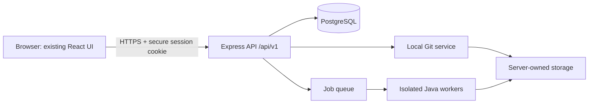
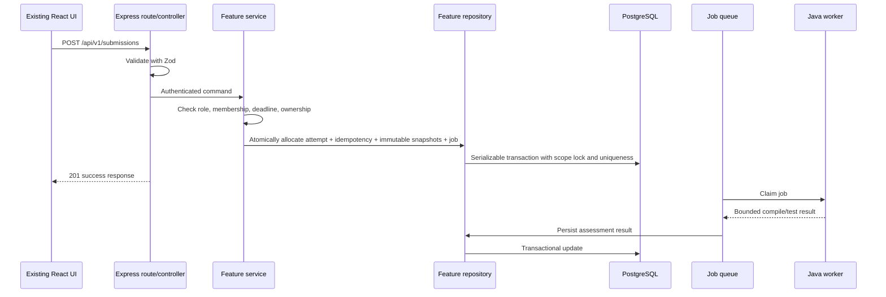
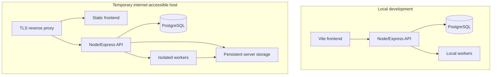

# Projex System Architecture

## Status and scope

This document records the architecture for turning the existing Projex UI prototype into a controlled full-stack system and the durable decisions accepted through Phase 6.

- Current frontend: React 19, Vite, JavaScript/JSX, React Router, and the existing CSS.
- Current backend: Node.js, Express, TypeScript, Zod, Prisma ORM, and PostgreSQL.
- Implementation status: Phases 0 through 5 are complete; Phase 6 submissions and automated assessment is implemented and verified on its phase branch and awaits pre-commit review.
- Development approach: local-first, feature-by-feature, and cloud-provider-neutral.
- Roles: `STUDENT`, `INSTRUCTOR`, and `ADMIN` are part of the authorization model from the beginning.
- Implementation priority: Student and Instructor workflows first, followed by dedicated Admin functionalization.
- Deployment objective: an internet-accessible temporary environment for controlled testing and project defense.
- Out of scope: university-wide production deployment, high availability, and a 24/7 service commitment.

## Document authority and historical snapshots

`docs/FUNCTIONALIZATION_AUDIT.md`, the root-level UI direction, feature inventory, route map, mock-data plan, UI implementation checklist, and instructor UI brief are historical snapshots of the hardcoded frontend and the product rules in effect when it was built. They remain valuable evidence and must not be rewritten to imply that the backend or current rules existed at that time.

When a historical snapshot conflicts with the current repository or `docs/architecture/`, the current repository and current architecture documents govern. In particular, the historical one-submission-only rule has been superseded: each programming activity configures one to three immutable, server-numbered attempts whose history is permanently preserved.

Mutable facts such as the checked-out Git branch are intentionally not recorded here; Git is authoritative for the active branch.

## Architectural goals

1. Preserve the current frontend layout, CSS, routes, and visible interactions while replacing hardcoded behavior incrementally.
2. Keep the frontend in JavaScript/JSX. No frontend TypeScript migration is planned.
3. Put business rules, authorization, persistence, Git operations, and Java execution behind backend boundaries.
4. Make core Git and Java features work locally without GitHub, GitLab, or external compiler APIs.
5. Keep deployment portable across a developer machine, a temporary VPS, GitHub Student Developer Pack credits, Azure for Students, another student cloud credit, or an SLU-provided host.
6. Protect academic records, hidden tests, grades, repository content, and detailed similarity data.

## System context

The browser never talks directly to PostgreSQL, Git, Java, the queue, or server storage. All access is mediated by authenticated and authorized backend services.

## Frontend architecture

The existing frontend remains the presentation system:

- **React 19** renders the student, instructor, and admin views.
- **Vite** remains the development and production build tool.
- **JavaScript/JSX** remains the frontend language.
- **React Router** retains current user-visible routes and shell nesting.
- **Existing CSS**, especially `src/App.css` and `src/index.css`, remains the visual contract.

Backend work may add JavaScript API adapters, loading/error handling, and data bindings, but it must not trigger a frontend TypeScript conversion or unrelated redesign. Existing mocks are removed only inside the feature currently being functionalized and only after equivalent live behavior exists.

## Backend architecture

The backend is a separate Node.js application built with:

- **Express** for HTTP routing and middleware.
- **TypeScript** for backend compile-time contracts.
- **Zod** for runtime validation of requests, environment variables, job payloads, and external process results.
- **Prisma ORM** for database access and migrations.
- **PostgreSQL** for transactional persistence.

The backend uses a feature-based modular monolith. This is simpler to develop and deploy than microservices while still providing clear boundaries that could later be extracted if justified.

## Feature modules

The backend will contain these domain modules:

- `auth`
- `users`
- `classes`
- `class-members`
- `activities`
- `test-cases`
- `submissions`
- `assessments`
- `feedback`
- `project-tasks`
- `teams`
- `repositories`
- `repository-members`
- `repository-invitations`
- `notifications`
- `analytics`

Course, section, term, archive, and storage concepts may begin within the closest owning feature and be promoted to their own feature only when their behavior warrants it. Module ownership must be explicit; two modules must not independently persist the same concept.

## Infrastructure modules

- `database`: Prisma client lifecycle, transactions, migrations, and database health.
- `git`: safe local Git CLI execution, bare repositories, temporary worktrees, path controls, and write locks.
- `java`: compilation/execution worker integration and result normalization.
- `job-queue`: PostgreSQL-backed job records, atomic claiming, leases, retries, bounded concurrency, terminal status, and worker coordination for the initial pilot.
- `storage`: server-owned roots, attachments, repository storage, temporary files, and cleanup.
- `logging`: structured application/security/job logs with request and job correlation IDs.

Infrastructure modules provide technical capabilities. They do not decide whether a user may submit, grade, invite, or modify a repository; feature services make those decisions.

## Request and job flow

Java compilation and execution never run in the main API process. Long-running Git or storage work should also be queued when it cannot complete within a short HTTP request.

The controlled pilot does not require Redis, RabbitMQ, or another dedicated queue product. The initial execution queue may use PostgreSQL job records, a separate worker process, atomic claiming, lease and retry fields, bounded concurrency, and terminal job states. It remains free, self-hosted, server-managed, and cloud-provider-neutral. A dedicated queue product is considered only if measured testing demonstrates a need.

## Submission-attempt model

- Each programming activity configures `maxAttempts` from 1 through 3 usable attempts.
- Each `Submission` is one immutable attempt with a server-assigned `attemptNumber` starting at 1.
- Ordinary submissions count toward the usable limit. Infrastructure-failed records granted a replacement become non-counting but remain immutable, so chronological `attemptNumber` may exceed `maxAttempts`.
- The backend atomically counts records with `countsTowardAttemptLimit=true`, verifies lifecycle/deadline or a valid replacement exception, selects the next chronological number, and creates the attempt, idempotency row, immutable test snapshots, and execution job.
- The frontend never chooses the authoritative attempt number.
- Idempotency plus database uniqueness on `(activityId, studentId, attemptNumber)` prevents a double-click or retry from creating duplicate attempts.
- Every attempt permanently preserves its source-code snapshot, submitted timestamp, execution result, score, late status, and review state as academic history.

## Assessment and review model

Projex separates deterministic automated assessment from instructor review:

- `originalAutomatedScore` is calculated from preserved per-test-case automated results and never overwritten.
- `effectiveAutomatedScore` is the latest valid append-only correction, or the original score when no correction exists.
- Every correction preserves the original score, previous effective score, new effective score, mandatory reason, instructor identity, and timestamp.
- `automatedMaximum` is the test-point sum and `instructorMaximum` is the remaining activity total. `finalScore = effectiveAutomatedScore + instructorPoints` within those bounds.
- Review timestamps and feedback-release timestamps are recorded.
- Grading and feedback drafts remain instructor-only until release.

## Role priority and Admin scope

Student and Instructor workflows are the first implementation priority because they provide the initial end-to-end academic test path. `ADMIN` remains in the user-role and authorization design from the beginning. In Phase 6, administrators have safe read-only submission visibility and cannot grade, correct, release, retry, or resolve failures.

The current admin frontend is only a temporary mock and feature inventory; it is not an approved final design or visual source of truth. Phase 9 remains backend-focused and defines approved account, class, repository, storage, archive, health, authorization, safe-projection, and operational-summary capabilities. Phase 10D will redesign and integrate the admin interface using the polished student/instructor interface as the visual source of truth. Admin access is explicit and audited; it does not automatically bypass data minimization, ownership, or privacy rules.

## Initial class-membership scope

The first Student/Instructor class workflow is intentionally small:

- An instructor creates a class and the server generates a unique class code.
- The instructor can rotate or revoke the code.
- A student joins with an active class code; duplicate membership is prevented.
- The instructor lists class members and can deactivate/remove current membership without deleting academic history.
- The backend checks class membership or instructor assignment for every protected class operation.

Class invitation email delivery, accept/decline pages, and invitation-expiry workflows are later enhancements unless separately required. Repository collaborator invitations remain in scope for project collaboration.

## Trust boundaries

- The frontend is untrusted. Roles, IDs, ownership claims, grades, test visibility, paths, Git arguments, and execution settings supplied by the browser must be verified or replaced by server-owned values.
- HTTP controllers are transport boundaries, not business-rule owners.
- Feature services are the authorization and transaction orchestration boundary.
- Feature repositories are the only normal route from a feature to persisted records.
- Git and Java modules accept typed, validated commands from services; they never accept raw shell strings from clients.
- Hidden test content and detailed similarity data are filtered on the server before a student response is built.

## Deployment topology

The deployable unit should use standard containers or ordinary Node/PostgreSQL processes, filesystem mounts, and environment variables. It must not require provider-specific databases, queues, object stores, identity systems, or serverless runtimes. PostgreSQL, OpenJDK/Java workers, and Git are self-hosted. A temporary VPS, GitHub Student Developer Pack credit, Azure for Students, another student cloud credit, or an SLU host may supply the infrastructure later. Cloudflare Tunnel and any particular cloud provider are optional, never mandatory. Java assessment remains disabled on an internet-accessible host until container or equivalent isolation is implemented and verified.

The hosted system is for controlled testing and defense only. It should have a defined test window, restricted accounts, backups appropriate to the demonstration, and a shutdown/removal plan. University-wide rollout, horizontal scaling, multi-region failover, and continuous availability are not Phase goals.

## Architecture rules

- API base path is `/api/v1`.
- All input is validated at the boundary with Zod.
- All authorization is enforced in the backend.
- Prisma is accessed through feature repositories or the database infrastructure module, not directly from controllers.
- Academic records are archived rather than hard-deleted.
- Cross-record invariants use database constraints and transactions.
- Activity `maxAttempts` is 1 through 3; immutable submission attempts use server-assigned numbering and permanent history.
- Automated scores remain distinct from instructor adjustments and derived final scores.
- Core Git operations use the local Git CLI safely; no GitHub or GitLab API is required.
- Core Java compilation/execution uses local OpenJDK workers; no external compiler API is allowed.
- Java workers compile once per submission assessment, then run the preserved compiled output against bounded test inputs.
- Logs must not contain passwords, session tokens, complete source code, hidden tests, or sensitive feedback.
- New infrastructure must remain replaceable without changing feature service contracts.

## Related documents

- `BACKEND_STRUCTURE.md` — module layout and layer responsibilities.
- `API_CONVENTIONS.md` — HTTP contracts and response envelopes.
- `DATABASE_CONVENTIONS.md` — Prisma/PostgreSQL naming and integrity rules.
- `SECURITY_RULES.md` — authentication, authorization, Git, Java, and hosting controls.
- `DEVELOPMENT_WORKFLOW.md` — branches, environments, verification, and Codex rules.
- `PHASE_CHECKLIST.md` — Phase 0 acceptance and later implementation gates.
