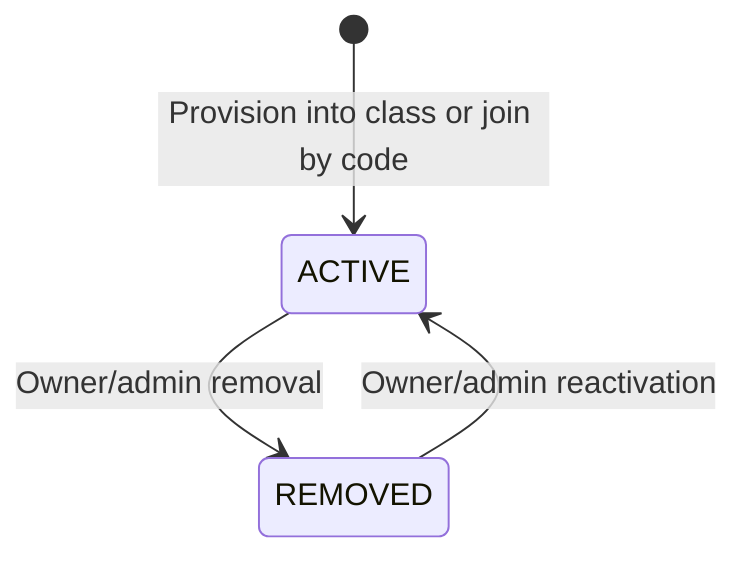

# User and Class Management

## Scope

Phase 4 implements backend-only user directory, class lifecycle, class join-code, roster, and membership APIs. The React frontend remains unchanged and continues to use its existing mocks until the approved frontend integration phase.

Out of scope are public registration, password reset, MFA, Google Sign-In, ownership transfer, CSV enrollment, invitation email, student self-leave, activities, submissions, Java execution, Git, repository collaboration, Admin UI integration, and persistent audit-event storage.

## Frontend integration status

The original Phase 4 delivery was backend-only. Phase 10A.2 now connects the protected student and instructor class catalogs, explicit URL-based class selection, class metadata/lifecycle actions, student class-code join, role-specific rosters, membership transitions, and server-owned join-code controls. Unsupported invitation, stream/comment, schedule/room, and class-rule concepts remain documented in `FRONTEND_INTEGRATION.md` and are not simulated as successful local behavior.

## User directory

`GET /api/v1/users` and `GET /api/v1/users/:userId` are global administrative endpoints. They require an authenticated ACTIVE administrator in both route middleware and the service.

The list supports `page`, `pageSize`, `search`, `role`, and `status`. Explicit Prisma selections return only ID, full name, email, role, status, and creation/update timestamps. Password hashes, setup tokens, refresh sessions, CSRF hashes, cookies, IP/user-agent session metadata, and credentials are never directory fields.

Instructor access to students remains scoped through owned class rosters and the existing provisioning workflow. Students do not receive a global directory.

## Class lifecycle

Classes transition between `ACTIVE` and `ARCHIVED`; they are never routinely hard-deleted.

- An instructor-created class is owned by the authenticated instructor.
- An admin-created class must name an existing ACTIVE user whose role is `INSTRUCTOR`.
- Ownership transfer is not implemented.
- Only the owner or an administrator may update, archive, restore, or manage a join code.
- Archived classes are read-only. Joins, metadata updates, join-code changes, and membership mutations are rejected.
- ACTIVE student membership permits read-only access to an archived class and its roster.
- Restoring a class leaves its previous join code inactive. The owner or administrator must rotate the code to allow new joins.

Class projections expose class and instructor identity, status, term metadata, and lifecycle timestamps. They never expose `classCode` to students.

## Join-code lifecycle

The minimal design keeps one unique `Class.classCode` plus `classCodeActive` and `classCodeChangedAt`.

- Codes are generated only by the backend using Node cryptographic randomness.
- Stored codes contain ten uppercase characters from an alphabet that omits ambiguous `0`, `1`, `I`, `L`, and `O` characters.
- Input is trimmed, uppercased, and stripped of display whitespace/hyphens before validation and lookup.
- A display separator is presentation only and is not stored.
- The unique database constraint is authoritative; create and rotation retry collisions at most five times.
- The Phase 4 migration normalizes valid legacy formatting inside an explicit transaction and aborts without partial changes if a legacy code is invalid or two codes would collide after normalization.
- Rotation cannot reuse the current code.
- Revocation sets `classCodeActive` false.
- Archive disables the code in the same database transaction.
- Restore does not activate it.
- Join requests are authenticated, CSRF-protected, role-restricted to students, and rate-limited.
- Generated and submitted codes are excluded from structured logs, request logs, errors, and student responses.

## Membership lifecycle

Phase 4 creates only ACTIVE memberships. `PENDING` remains reserved for a later invitation workflow.

- The unique `(classId, studentId)` row is reused and never deleted by normal membership operations.
- Joining while already ACTIVE is idempotent and returns the existing row.
- REMOVED membership preserves history but grants no active or archived class/roster access.
- A REMOVED student cannot rejoin using a code; only an owner/admin transition reactivates the row.
- Archived classes reject removal/reactivation.
- `joinedAt` preserves original enrollment, `removedAt` records removal, and `lastActivatedAt` records the latest activation.

Student roster entries expose only `userId` and `fullName`. Owner/admin roster entries additionally expose `memberId`, email, user status, membership status, `joinedAt`, `removedAt`, and `lastActivatedAt`.

## Authorization matrix

| Action | Student | Instructor | Admin |
| --- | --- | --- | --- |
| Global users | Denied | Denied | All safe records |
| Create class | Denied | Self-owned | For ACTIVE instructor |
| List/view classes | ACTIVE memberships | Owned classes | All classes |
| Update/archive/restore | Denied | Owner | Allowed |
| View/rotate/revoke code | Denied | Owner | Allowed |
| Join by code | Authenticated ACTIVE student | Denied | Denied |
| View roster | ACTIVE member, minimal fields | Owner, detailed fields | Detailed fields |
| Remove/reactivate member | Denied | Owner of active class | Active class |

Service methods repeat role, status, ownership, membership, and lifecycle checks; middleware alone is never authoritative. Unauthorized cross-class access uses a safe not-found response where resource existence is private.

## Logging and deferred audit storage

Structured events record actor and resource IDs for class creation/update/archive/restore, code rotation/revocation, student join, removal, and reactivation. Join codes and submitted bodies are not logged.

Phase 4 does not add a persistent audit-event table. Durable administrative audit storage remains Phase 11 hardening work.

Phase 9A later adds a narrow `AdminAuditEvent` ledger for successful allowlisted admin account/class/membership mutations. This preserves the historical Phase 4 statement while moving atomic accountability for current admin mutations earlier; Phase 11 still owns comprehensive retention, export, tamper-evidence, and broader security-event hardening.

## PostgreSQL integration tests

`npm test` remains the isolated suite. `npm run test:integration` uses a guarded launcher that:

1. Requires `TEST_DATABASE_URL` and never falls back to `DATABASE_URL`.
2. Aborts before Prisma or Vitest starts unless the URL names exactly the recognized `projex_test` database.
3. Injects that URL as `DATABASE_URL` only into the migration/test child processes without printing it.
4. Applies committed migrations through `prisma migrate deploy`.
5. Runs integration files serially.
6. Cleans records using Prisma operations in dependency order.
7. Never invokes `prisma db push` or `prisma migrate reset`.

The database-backed suite covers user persistence, filters, pagination, and safe projections; the unique class-code constraint and collision retry; instructor ownership; role-scoped class visibility; student data boundaries; new, duplicate, concurrent, removed-member, rotated-code, and revoked-code join behavior; membership removal, reactivation, and preserved history; archived-class restrictions and restore behavior; role-specific roster projections; safe cross-class denial; and transaction rollback on partial failure.

The completed Phase 4 verification runs three integration files with ten tests against exactly `projex_test`. Suite-level cleanup leaves all integration fixture application tables empty while preserving all Prisma migration-history rows. A private recognized test database remains an explicit execution prerequisite for future runs.

Live verification against the normal development API completed the approved administrator, instructor, and student workflows. It confirmed safe user-directory projections, single-use setup, class and membership lifecycle behavior, join-code invalidation and secrecy, archived-class read-only access, structured security events, and log redaction. The retained verification fixtures consist of three users, one ACTIVE class with an active rotated code, and one ACTIVE membership; no credential, session value, setup link, join code, database URL, or private environment value is recorded in this document.
