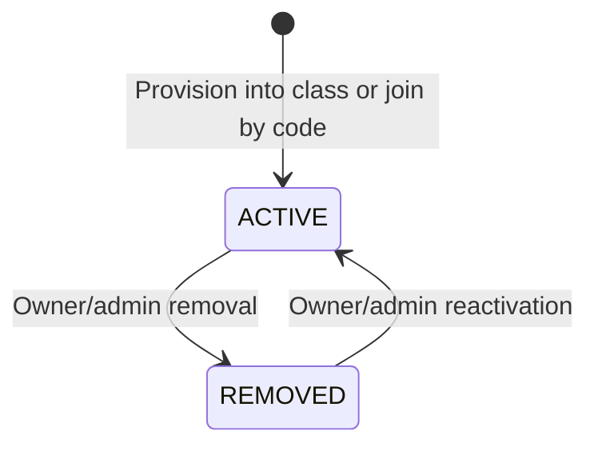
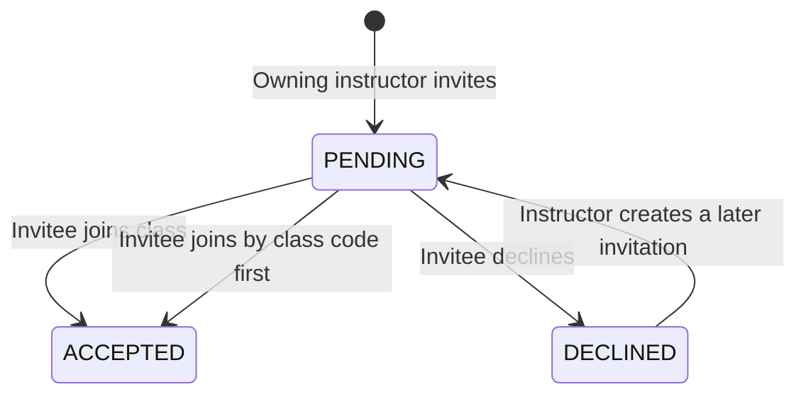

# User and Class Management

## Iteration 2 Course and Class Offering extension (unaccepted WIP)

The approved foundation extends the historical Phase 4/10/11 contract below. `Course` is an Admin-managed reusable catalog entry containing Course Number and Course Name only. A `Class` remains the offering and all existing academic relationships continue to use its UUID. The nullable Course relationship, Course Number/Name snapshots, Official Class Code, Academic Period (`FIRST_SEMESTER` or `SECOND_SEMESTER`), School Year, Schedule, Days and Room are offering attributes. The generated, revocable `Class.classCode` remains the private Projex **join code**. There is no global uniqueness constraint on Official Class Code and no Course semester restriction. Legacy Classes remain valid without structured official fields.

An Instructor may create an informal ACTIVE teaching Class, optionally linking a Course. Admin may create an official Class with an ACTIVE Primary Instructor or leave it PREPARED until assignment. A PREPARED Class has no responsible Instructor and its join code is inactive; it is not a usable teaching workspace. Admin may verify an existing informal Class as official **in place**, preserving its UUID, memberships, activities, submissions, grades, repositories and staff history. That workflow displays history impact, requires a reason and explicit acknowledgement when history exists, compares the submitted version, and records before/after identity in the Admin audit ledger. Course catalog edits do not rewrite an offering's saved Course snapshots. Official Course identity, Class Code, Academic Period and School Year corrections use the guarded Admin path; schedule, days and room remain editable through ordinary permitted class metadata changes.

ACTIVE Classes require a Primary Instructor. The Primary may invite an eligible ACTIVE Instructor as Co-Instructor; the invitee gains access only after acceptance. Active Co-Instructors have class-scoped teaching access to affected activity, submission/review/rerun, project and repository paths, plus Student roster and invitation workflows. Routine teaching-staff invitations, Primary transfer, class governance and join-code controls remain Primary-only (with separate Admin recovery/governance authority); a Co-Instructor cannot invite or remove other teaching staff or transfer Primary. Primary transfer targets an active Co-Instructor and explicitly chooses whether the former Primary remains an active Co-Instructor or leaves. Admin recovery may assign an ACTIVE Instructor, including to a PREPARED offering, with a recorded reason and explicit former-Primary disposition. Historical creator/reviewer attribution remains attached to the original users; access changes do not rewrite academic records. An account that remains Primary for an ACTIVE Class cannot be deactivated before reassignment.

Admin may preview/validate/confirm a bounded Course CSV import atomically. Instructor or Admin may preview/confirm a bounded CSV of **registered ACTIVE Student email invitations** for an ACTIVE Class. Preview writes nothing, confirmation revalidates, and successful confirmation creates pending invitations only; Student acceptance remains necessary for membership. No direct roster enrollment, offering CSV import, curriculum, Units, join-request state, or registrar integration is included. The historical text below describes the earlier accepted baseline where it conflicts with this in-progress extension.

## Scope

Phase 4 established the backend user directory, class lifecycle, class join-code, roster, and membership APIs. Phase 10 integrated those contracts into the React frontend, and Phase 11 stabilization adds registered-email class invitations without replacing class-code joining.

Out of scope for the class-invitation addition are public registration, pre-registration or external-email invitations, password reset, MFA, Google Sign-In, ownership transfer, CSV enrollment, SMTP delivery, student self-leave, and a generic notification subsystem.

## Frontend integration status

The original Phase 4 delivery was backend-only. Phase 10A.2 connects the protected student and instructor class catalogs, explicit URL-based class selection, class metadata/lifecycle actions, student class-code join, role-specific rosters, membership transitions, and server-owned join-code controls. Phase 10D.2 connects administrator class governance and the bounded Phase 9 academic oversight projections. Phase 11 stabilization connects registered-email invitation creation during instructor class creation and from the selected-class People area, plus the student Home preview and dedicated invitation view. Stream/comment, schedule/room, instructor-reassignment, and class-rule concepts remain deferred and are not simulated as successful local behavior.

## User directory

`GET /api/v1/users` and `GET /api/v1/users/:userId` are global administrative endpoints. They require an authenticated ACTIVE administrator in both route middleware and the service.

The list supports `page`, `pageSize`, `search`, `role`, and `status`. Explicit Prisma selections return only ID, full name, email, role, status, and creation/update timestamps. Password hashes, setup tokens, refresh sessions, CSRF hashes, cookies, IP/user-agent session metadata, and credentials are never directory fields.

Instructor access to students remains scoped through owned class rosters and the existing provisioning workflow. Students do not receive a global directory.

## Class lifecycle

Classes transition between `ACTIVE` and `ARCHIVED`; they are never routinely hard-deleted.

- An instructor-created class is owned by the authenticated instructor.
- An admin-created class must name an existing ACTIVE user whose role is `INSTRUCTOR`.
- Ownership transfer is not implemented.
- Only the owner or an administrator may update, archive, restore, or manage a join code.
- Archived classes are read-only. Joins, metadata updates, join-code changes, and membership mutations are rejected.
- ACTIVE student membership permits read-only access to an archived class and its roster.
- Restoring a class leaves its previous join code inactive. The owner or administrator must rotate the code to allow new joins.

Class projections expose class and instructor identity, status, term metadata, and lifecycle timestamps. They never expose `classCode` to students.

## Join-code lifecycle

The minimal design keeps one unique `Class.classCode` plus `classCodeActive` and `classCodeChangedAt`.

- Codes are generated only by the backend using Node cryptographic randomness.
- Stored codes contain ten uppercase characters from an alphabet that omits ambiguous `0`, `1`, `I`, `L`, and `O` characters.
- Input is trimmed, uppercased, and stripped of display whitespace/hyphens before validation and lookup.
- A display separator is presentation only and is not stored.
- The unique database constraint is authoritative; create and rotation retry collisions at most five times.
- The Phase 4 migration normalizes valid legacy formatting inside an explicit transaction and aborts without partial changes if a legacy code is invalid or two codes would collide after normalization.
- Rotation cannot reuse the current code.
- Revocation sets `classCodeActive` false.
- Archive disables the code in the same database transaction.
- Restore does not activate it.
- Join requests are authenticated, CSRF-protected, role-restricted to students, and rate-limited.
- Generated and submitted codes are excluded from structured logs, request logs, errors, and student responses.

## Membership lifecycle

Class-code joins and accepted registered-email invitations create only ACTIVE memberships. The `PENDING` membership status remains unused; invitation pending state is stored separately so both enrollment paths converge on the same unique membership row.

```mermaid
stateDiagram-v2
    [*] --> ACTIVE: Provision into class or join by code
    ACTIVE --> REMOVED: Owner/admin removal
    REMOVED --> ACTIVE: Owner/admin reactivation
```

- The unique `(classId, studentId)` row is reused and never deleted by normal membership operations.
- Joining while already ACTIVE is idempotent and returns the existing row.
- REMOVED membership preserves history but grants no active or archived class/roster access.
- A REMOVED student cannot rejoin using a code; only an owner/admin transition reactivates the row.
- Archived classes reject removal/reactivation.
- `joinedAt` preserves original enrollment, `removedAt` records removal, and `lastActivatedAt` records the latest activation.

## Registered-email invitation lifecycle

An owning ACTIVE instructor may invite an existing ACTIVE `STUDENT` by the account's exact normalized university email. This is an internal Projex workflow: it does not create accounts, send email, use Google authentication, or expose a general student directory.

```mermaid
stateDiagram-v2
    [*] --> PENDING: Owning instructor invites
    PENDING --> ACCEPTED: Invitee joins class
    PENDING --> ACCEPTED: Invitee joins by class code first
    PENDING --> DECLINED: Invitee declines
    DECLINED --> PENDING: Instructor creates a later invitation
```

- A partial unique index permits at most one `PENDING` invitation for a class/invitee pair while preserving accepted and declined history.
- Only the invitee may list or respond to an invitation. Student projections contain class name, section, term, and instructor display name; they omit class code and email.
- Acceptance creates a new ACTIVE membership or reactivates the existing REMOVED row, then resolves the invitation in one serializable transaction. The original `joinedAt` remains preserved on reactivation.
- A removed student still cannot rejoin using a class code. A later invitation requires an explicit instructor action and the student's acceptance before reactivation.
- Decline creates no membership and remains durable. A later invitation is allowed.
- Joining by class code atomically resolves a matching pending invitation as accepted, so it cannot remain misleadingly actionable.
- Concurrent accept requests are serialized and return the same authoritative ACTIVE membership without duplication.
- Archived classes hide pending invitations from student lists and reject creation, acceptance, and decline.
- Optional class-creation invitations are validated in full before the class and all invitation rows are created atomically. Any invalid target rejects the complete request; creating a class with no invitations remains unchanged.

Student roster entries expose only `userId` and `fullName`. Owner/admin roster entries additionally expose `memberId`, email, user status, membership status, `joinedAt`, `updatedAt`, `removedAt`, and `lastActivatedAt`. Administrative membership changes send the latest detailed-roster `updatedAt` as `expectedUpdatedAt`; a stale value returns `409 STALE_CLASS_MEMBER_VERSION`, after which the frontend refetches and requires a deliberate retry.

## Authorization matrix

| Action | Student | Instructor | Admin |
| --- | --- | --- | --- |
| Global users | Denied | Denied | All safe records |
| Create class | Denied | Self-owned | For ACTIVE instructor |
| List/view classes | ACTIVE memberships | Owned classes | All classes |
| Update/archive/restore | Denied | Owner | Allowed |
| View/rotate/revoke code | Denied | Owner | Allowed |
| Join by code | Authenticated ACTIVE student | Denied | Denied |
| Lookup/invite by registered email | Denied | Owner of ACTIVE class | Denied |
| List/respond to received invitations | Own pending invitations | Denied | Denied |
| View roster | ACTIVE member, minimal fields | Owner, detailed fields | Detailed fields |
| Remove/reactivate member | Denied | Owner of active class | Active class |

Service methods repeat role, status, ownership, membership, and lifecycle checks; middleware alone is never authoritative. Unauthorized cross-class access uses a safe not-found response where resource existence is private.

## Logging and deferred audit storage

Structured events record actor and resource IDs for class creation/update/archive/restore, code rotation/revocation, student join, removal, and reactivation. Join codes and submitted bodies are not logged.

Phase 4 does not add a persistent audit-event table. Durable administrative audit storage remains Phase 11 hardening work.

Phase 9A later adds a narrow `AdminAuditEvent` ledger for successful allowlisted admin account/class/membership mutations. This preserves the historical Phase 4 statement while moving atomic accountability for current admin mutations earlier; Phase 11 still owns comprehensive retention, export, tamper-evidence, and broader security-event hardening.

## PostgreSQL integration tests

`npm test` remains the isolated suite. `npm run test:integration` uses a guarded launcher that:

1. Requires `TEST_DATABASE_URL` and never falls back to `DATABASE_URL`.
2. Aborts before Prisma or Vitest starts unless the URL names exactly the recognized `projex_test` database.
3. Injects that URL as `DATABASE_URL` only into the migration/test child processes without printing it.
4. Applies committed migrations through `prisma migrate deploy`.
5. Runs integration files serially.
6. Cleans records using Prisma operations in dependency order.
7. Never invokes `prisma db push` or `prisma migrate reset`.

The database-backed suite covers user persistence, filters, pagination, and safe projections; the unique class-code constraint and collision retry; instructor ownership; role-scoped class visibility; student data boundaries; new, duplicate, concurrent, removed-member, rotated-code, and revoked-code join behavior; membership removal, reactivation, and preserved history; archived-class restrictions and restore behavior; role-specific roster projections; safe cross-class denial; and transaction rollback on partial failure.

The completed Phase 4 verification runs three integration files with ten tests against exactly `projex_test`. Suite-level cleanup leaves all integration fixture application tables empty while preserving all Prisma migration-history rows. A private recognized test database remains an explicit execution prerequisite for future runs.

Live verification against the normal development API completed the approved administrator, instructor, and student workflows. It confirmed safe user-directory projections, single-use setup, class and membership lifecycle behavior, join-code invalidation and secrecy, archived-class read-only access, structured security events, and log redaction. The retained verification fixtures consist of three users, one ACTIVE class with an active rotated code, and one ACTIVE membership; no credential, session value, setup link, join code, database URL, or private environment value is recorded in this document.
