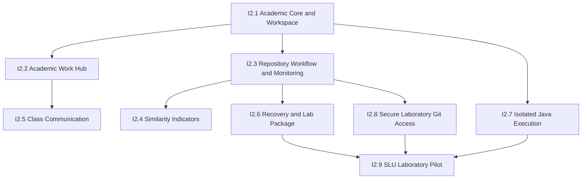

# Projex Iteration 2 Roadmap

## Program name

**Projex Iteration 2 — Classroom and Laboratory Readiness**

Historical work keeps its original Phase 0–11 names. New work uses `I2.1`, `I2.2`, and so on, avoiding confusing labels such as “Phase 12.”

## Outcome

Iteration 2 turns the accepted Home-LAN-tested baseline into a coherent classroom and SLU laboratory pilot. It fills the most important academic workflow gaps, proves realistic exercises, hardens Java execution, enables controlled laboratory Git access, and prepares a recoverable pilot deployment.

## Rules across every milestone

- Implement both backend logic and frontend UI when the feature needs both.
- Report backend-only or UI-only work honestly; neither is “complete.”
- Keep authorization on the backend. Frontend hiding is only a usability aid.
- Never fall back to mock academic data after an API failure.
- Preserve immutable submissions, attempts, corrections, and academic history.
- Keep secrets, hidden tests, source code, Git paths, and private environment values out of logs and unsafe projections.
- Use migrations for schema changes; never use `prisma db push` or `prisma migrate reset`.
- Test against `projex_test` first. Normal-database migrations require separate approval.
- Do not expose Java or Git to a network merely to make a demo pass.
- Stop at each milestone’s pre-commit review and integration gates.

## Dependency order

I2.4 and I2.5 may move later when time is tight. I2.6–I2.9 are required before claiming laboratory pilot readiness.

## How weekly ownership works

The roadmap is ordered by dependency, not by guaranteed one-week duration. One teammate owns one member-specific branch for their assigned week and completes as much coherent, tested work as safely possible. If work remains, the next teammate creates their own branch from the previous member’s reviewed commit. Nobody restarts from an older baseline or pretends an unfinished milestone is complete.

## I2.1 — Academic Core and Programming Workspace

Milestone report: `docs/team/milestones/I2.1.md`

### Core outcome

Prove the programming-activity workflow using sanitized Programming 1 prelim exercises and make source entry practical without turning Projex into a browser IDE.

### Build and verify

- Import exactly one UTF-8 `.java` file into the existing editor.
- Reuse the current Run Visible Tests and Submit APIs; file import is a frontend input method, not a new execution path.
- Enforce a size aligned with the current 100,000-character source limit.
- Validate the selected filename and public entry-class expectation.
- Ask before overwriting non-empty editor content.
- Never upload or store a local path.
- Keep source in browser memory until the student deliberately runs or submits.
- Enhance the existing textarea with line numbers, indentation guides, monospace alignment, Tab/Shift+Tab, auto-indent, synchronized vertical scrolling, and horizontal scrolling without soft wrapping.
- Improve post-run compiler diagnostics and focus the referenced line when safely parseable.
- Preserve resizable panes and narrow-screen usability.
- Validate correct output, wrong output, compilation error, runtime error, timeout, final-newline behavior, attempts, Latest/Highest credit, review, release, close, and reopen.
- If time remains, integrate the already-existing account security capabilities into the user UI.

### Explicitly not included

- CodeMirror or Monaco.
- Continuous compilation on every keystroke.
- Autocomplete, refactoring, debugger, multi-file project editing, or a full IDE.
- A new compiler API or browser-side Java compiler.

### Layer expectation

| Layer | Expected work |
| --- | --- |
| Backend logic | Reused for import; small changes only if real exercise testing exposes an approved defect |
| Frontend UI | New file import and textarea aids; existing workflow retained |
| Database | No change expected |
| Automated tests | Required for import validation, editor behavior, and affected activity flows |
| Manual validation | Required using sanitized real exercises on desktop and narrow layout |
| Overall | Complete only when UI, tests, and manual workflow pass |

## I2.2 — Academic Work Hub

Milestone report: `docs/team/milestones/I2.2.md`

### Core outcome

Give each role one truthful cross-class work view.

- Student To-Do: upcoming and overdue activities and project tasks across every active class membership.
- Student Submissions: global submission/attempt history with released-result visibility rules.
- Instructor Review Queue: accepted work requiring assessment recovery, review, feedback, or release across owned classes.
- Dashboard entry points, bounded filters, stable sorting, pagination, empty/loading/error states, and privacy checks.

### Boundaries

- Do not invent cached counts when authoritative records can be queried.
- Do not expose another student’s work or unreleased results.
- Do not mix announcements or generic notifications into this milestone.

### Layer expectation

Backend logic: **New or changed API projections**. Frontend UI: **New and integrated**. Database: **existing unless measured evidence proves an index is necessary**. Automated and manual cross-role testing: **required**.

## I2.3 — Repository Workflow and Monitoring

Milestone report: `docs/team/milestones/I2.3.md`

### Core outcome

Make the existing project/repository workflow discoverable and add truthful activity evidence.

- Manually prove project-task creation, publish/close lifecycle, team/repository creation, invitations, membership, ready-for-review, request changes within allowed time, approval, and feedback release.
- Fix only confirmed discoverability or workflow defects.
- Add a real repository activity feed based on accepted Git operations and existing repository events.
- Add contribution evidence only when it can be tied to an authenticated Projex user and accepted repository operation.
- Prefer counts and named events over percentages.

### Truth rule

Git commit author text alone is self-declared and must not be presented as verified student authorship. Never fabricate contribution percentages, activity, commits, or presence.

### Layer expectation

Backend logic: **Changed/New monitoring projections**. Frontend UI: **Integrated monitoring and workflow discoverability**. Database: **existing first; migration only with separate approval**. Real Git and PostgreSQL tests plus manual team workflow: **required**.

## I2.4 — Similarity Indicators

Milestone report: `docs/team/milestones/I2.4.md`

### Core outcome

Provide instructor-only similarity indicators for submissions to the same activity as a review aid—not a plagiarism verdict.

### Required design gate before implementation

- Approved comparison algorithm and normalization rules.
- Minimum source length and false-positive treatment.
- Privacy, access, explanation, and retention rules.
- When calculation occurs and whether results can be recomputed/versioned.
- Safe instructor UI wording and evidence presentation.

The existing `SimilarityResult` model is only a foundation. It does not prove a working feature.

## I2.5 — Class Communication

Milestone report: `docs/team/milestones/I2.5.md`

### Core outcome

Add class announcements and truthful in-app notifications. Add comments only after moderation and lifecycle rules are approved.

### Boundaries

- No fake notification counters or local-only announcements.
- Core notification behavior must not require SMTP.
- Email delivery, if later added, is a separate operational capability.
- Define audience, read state, archive behavior, author permissions, and privacy before creating models.

## I2.6 — Recovery and Laboratory Package

Milestone report: `docs/team/milestones/I2.6.md`

### Core outcome

Prove Projex can be installed, restarted, backed up, and restored as a complete academic system.

- Execute a guarded paired backup of PostgreSQL and the complete managed Git root.
- Restore to isolated targets and verify checksums, database relationships, and Git repositories.
- Finalize release/start/stop/restart/rollback instructions.
- Validate environment inventory without committing secrets.
- Resolve the current production SMTP/startup expectation before pilot packaging.
- Document what happens after host shutdown and how the operator recovers.

No destructive normal-data restore is allowed without explicit approval.

## I2.7 — Isolated Java Execution

Milestone report: `docs/team/milestones/I2.7.md`

### Core outcome

Move untrusted Java assessment from host `local_process` execution into a container or equivalent OS-level sandbox suitable for the controlled pilot.

- Preserve the separate durable worker and immutable assessment records.
- Enforce CPU, memory, wall-time, output, process-count, filesystem, and network limits.
- Use disposable per-job execution environments.
- Keep the API process incapable of directly executing Java.
- Verify cleanup and recovery after crashes and timeouts.
- Keep fail-closed disabled mode when isolation is unavailable.

This milestone must not claim perfect sandbox security. It needs an explicit threat model and independent review.

## I2.8 — Secure Laboratory Git Access

Milestone report: `docs/team/milestones/I2.8.md`

### Core outcome

Allow approved SLU laboratory computers to use native Git clone, fetch, and push over HTTPS while connected to the approved laboratory network.

- Preserve short-lived, repository-scoped credentials and dynamic authorization.
- Put Git transport behind reviewed TLS and reverse-proxy rules.
- Restrict exposure to the approved laboratory network and host.
- Keep repository/team membership checks authoritative on every operation.
- Preserve protected refs, atomic multi-ref validation, and accepted-push activity recovery.
- Document VS Code/native Git commands and the browser/native-Git division.
- Test revocation, removed membership, cross-repository access, concurrent pushes, restart, and audit behavior.

### Explicitly not included

- Browser file/commit/branch authoring.
- GitHub or GitLab API dependency.
- Public Internet Git access.
- Any-device access from outside the approved laboratory network.

## I2.9 — SLU Laboratory Pilot

Milestone report: `docs/team/milestones/I2.9.md`

### Core outcome

Deploy the accepted release to the approved SLU laboratory host for controlled testing.

- Configure PostgreSQL, API, frontend, Java worker, and Git worker as supervised services.
- Apply reviewed migrations as a controlled release step.
- Use private pilot accounts and a defined test window.
- Validate Student, Instructor, and Admin workflows on multiple laboratory computers.
- Validate programming exercises, Java isolation, repository collaboration, and laboratory Git access.
- Prove restart, backup, restore, rollback, health checks, and log review.
- Record findings and decide whether another iteration is required.

The pilot is not approval for university-wide deployment, 24/7 availability, high availability, or public Internet access.

## Deferred beyond the core pilot

- CodeMirror or another richer editor (candidate for Iteration 3).
- Browser Git authoring.
- Advanced gradebook and rubric workflows.
- Advanced analytics.
- Google OAuth.
- Public Internet Git and general remote access.
- Full CI/CD and high-availability operations.
- University-wide production deployment.

## Completion checklist for every milestone

- [ ] Scope and exclusions reconfirmed against repository evidence.
- [ ] Feature-layer report completed.
- [ ] Backend authorization and privacy verified where applicable.
- [ ] PostgreSQL integration tests use only the guarded test database.
- [ ] Frontend tests, lint, build, desktop, and narrow checks pass when UI changes.
- [ ] Java/Git boundary tests pass when affected.
- [ ] No secrets or runtime storage enter the diff.
- [ ] Developer Codex report and ChatGPT Checker decision recorded for each accepted slice.
- [ ] The active `docs/team/milestones/I2.X.md` report matches the accepted evidence and handoff state.
- [ ] Final logical diff reviewed.
- [ ] Commit/push happens only after its explicit gate.
- [ ] Integration into `development/fullstack` happens only after separate review and approval.
