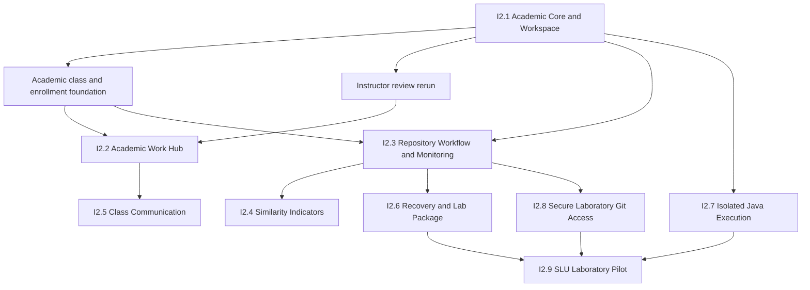

# Projex Iteration 2 Roadmap

## Revision control

- Revision: **I2-R4**
- Revised: **2026-09-22**
- Deadline target: **2026-10-30** for the system and research paper
- Planning authority: this file owns Iteration 2 scope and dependency order.
- Execution status: `docs/team/ITERATION_2_CHECKLIST.md` owns the maintained phase checklist.
- Evidence: an active `docs/team/milestones/I2.X.md` report records completed checks; Git, source, Prisma and actual test output remain live-state authority.

### I2-R2 change log

- Reconciles the September 18 adviser consultation with current repository evidence.
- Records I2.1 core as implemented and verified but still at its final-review gate; nothing is staged, committed or integrated.
- Keeps the existing I2.1 through I2.9 phase structure and adds bounded adviser follow-ups rather than inventing a second roadmap.
- Separates official academic class data from the existing Projex-generated join code.
- Records a proposed `Course` catalog with the existing `Class` retained as the class-offering record; schema details remain awaiting approval.
- Records Admin-managed class-offering and roster import as proposed academic-foundation work.
- Confirms Instructor review rerun as a required follow-up while keeping Student manual stdin a separately evaluated bounded option, not a browser-IDE commitment.
- Clarifies that scoring allocation and explicit release already exist, while allocation UX, minimum criteria, ungraded activities and post-release amendments have different implementation boundaries.
- Records the accepted working direction of one Student-owned class workspace repository per Student per class, but leaves its migration/API design awaiting approval.
- Adds local Git validation before network exposure, preserves loopback-only Smart HTTP today, and retains I2.8 as the gate for laboratory-network Git.
- Prioritizes I2.6 through I2.9 before the laboratory pilot and identifies I2.4/I2.5 and advanced grading/UI work as deferrable before the deadline.

### I2-R3 status reconciliation

- I2.1's 16-file core passed final review and was committed and pushed on the Julius task branch at `448dc5843865ee669f60473bcdb0f543875f084d`; integration into `development/fullstack` remains a separate gate.
- Bounded Instructor rerun implementation, including its non-destructive durable-queue schema extension, is now approved. Test-database migration verification precedes any normal-database migration, which is not approved. The implementation stops at pre-commit review.
- The other adviser follow-ups and I2.2–I2.9 retain their separate gates.

### I2-R4 handoff reconciliation

- Instructor Rerun has an implemented but **unaccepted WIP** slice. Guarded test-database checks passed; normal-local migration, authenticated walkthrough, and retention decision remain pending. A reviewed WIP checkpoint transfers code, not final feature acceptance.
- Sequential member handoff uses the previous member’s exact reviewed, pushed commit SHA and `iteration-2/<member>-work-<rotation>` branches. Julius’s existing branch name remains unchanged.
- By team policy Julius alone handles the later PR into `development/fullstack` and, after final acceptance, a separate PR into `main`. Both protected branches currently require a PR and one approval; this does not assert technically exclusive GitHub permissions.

## Program name

**Projex Iteration 2 — Classroom and Laboratory Readiness**

Historical work keeps its original Phase 0–11 names. New work uses `I2.1`, `I2.2`, and so on, avoiding confusing labels such as “Phase 12.”

## Outcome

Iteration 2 turns the accepted Home-LAN-tested baseline into a coherent classroom and SLU laboratory pilot. It fills the most important academic workflow gaps, proves realistic exercises, hardens Java execution, enables controlled laboratory Git access, and prepares a recoverable pilot deployment.

## Current verified position

As of I2-R4, development is on `iteration-2/julius-i2-1-academic-workspace`; I2.1's core commit is `448dc5843865ee669f60473bcdb0f543875f084d`. The pre-checkpoint HEAD is `190e65cfcf9414c6a28059c443ff82294d3cce19`; verify current HEAD directly before work.

- **I2.1 core: VERIFIED AND COMMITTED ON TASK BRANCH — integration pending.** The 16-file Java import/editor/exercise-evidence slice and authenticated Student/Instructor walkthrough passed; task-branch commit/push is complete.
- **Instructor rerun: IMPLEMENTED / UNACCEPTED WIP — checkpoint review.** The bounded durable-queue/schema slice passed guarded `projex_test` checks. Normal migration, authenticated walkthrough, retention decision, and final acceptance remain separate gates.
- **Other I2.1 follow-ups: PROPOSED / AWAITING APPROVAL.** Entry-class explanation, compact test-case authoring, scoring-allocation clarity and invitation-flow simplification remain bounded UX candidates. Personalized nonempty-output checking and ungraded activities need separate implementation decisions.
- **I2.2 through I2.9: PENDING.** No later Iteration 2 phase has started.
- Existing Phase 0–11 history remains unchanged. A working UI, model or test foundation does not mark an Iteration 2 capability complete.

## Rules across every milestone

- Implement both backend logic and frontend UI when the feature needs both.
- Report backend-only or UI-only work honestly; neither is “complete.”
- Keep authorization on the backend. Frontend hiding is only a usability aid.
- Never fall back to mock academic data after an API failure.
- Preserve immutable submissions, attempts, corrections, and academic history.
- Keep secrets, hidden tests, source code, Git paths, and private environment values out of logs and unsafe projections.
- Use migrations for schema changes; never use `prisma db push` or `prisma migrate reset`.
- Test against `projex_test` first. Normal-database migrations require separate approval.
- Do not expose Java or Git to a network merely to make a demo pass.
- Stop at each milestone’s pre-commit review and integration gates.

## Dependency order

The academic-foundation and review-rerun nodes are bounded follow-ups inside the existing Iteration 2 program, not new numbered phases. Their architecture and migrations remain approval gates. I2.4 and I2.5 may move later when time is tight. I2.6–I2.9 are required before claiming laboratory pilot readiness.

## Academic data direction awaiting implementation approval

Projex must distinguish these concepts:

1. `Class.id`: the permanent internal UUID and relationship key.
2. Official SAMCIS class code: identifies one class offering within an academic period and may recur in another period.
3. Course number: for example `IT 112` or `IT 112L`.
4. Course description: for example `COMPUTER PROGRAMMING 1 (LEC)`.
5. Academic period: semester/term and school year.
6. Projex join code: the existing generated, revocable enrollment secret; it is not the official class code.
7. Optional offering metadata: units, schedule, days and room.

The preferred design is a small reusable `Course` catalog while retaining the existing `Class` model and table as the class-offering record. This avoids rewiring every existing `Class` relationship while preventing course descriptions from being copied inconsistently across many offerings. The exact uniqueness rule for official class codes must be confirmed with SLU before adding a database constraint. No official class code may be invented, and the supplied course list does not expand Java or automated-checking scope.

Readable titles may be derived from structured fields, but unexplained institutional prefixes such as `CIS-1` must not be generated until their meaning is confirmed. A display title is not a database identity.

### Proposed Admin import boundary

- Admin imports or confirms courses and class offerings, assigns an existing ACTIVE Instructor, and previews every normalized row before mutation.
- Admin roster import targets one confirmed class offering and matches only existing ACTIVE Student accounts.
- A confirmed official roster import may create or reactivate ACTIVE memberships directly because the Admin is asserting an authoritative enrollment source. Unknown accounts, ambiguous offerings, duplicate rows and malformed values remain errors; accounts are never auto-created.
- Omission from a later file never removes an existing member automatically. Removal remains an explicit audited action.
- Manual Instructor invitation remains available for individual additions. Student use of a join code should create an Instructor-approved request rather than immediate membership, subject to an approved membership design.
- Raw roster files and unnecessary personal data must not be retained. A bounded audit summary should record actor, import type, target, counts and time without storing credentials or the complete file.

## How sequential member ownership works

The roadmap is ordered by dependency, not by guaranteed duration. Julius hands a reviewed, pushed checkpoint to Freiser, then Freiser to the next member, each on `iteration-2/<member>-work-<rotation>` from the previous exact pushed SHA. Keep Julius’s existing branch name. Each member tests relevant work, performs a manual web-app walkthrough before claiming handoff validation, and reports any approval-blocked check as pending. Nobody restarts from an older baseline, creates extra integration branches or forks, or pretends WIP is complete. Members push only their own branches. Julius later reviews the latest accepted branch and proposes cumulative changes through a PR into `development/fullstack`, then a separate PR from there into `main` after final acceptance. Preserve genuine commit authorship.

## I2.1 — Academic Core and Programming Workspace

Milestone report: `docs/team/milestones/I2.1.md`

### Core outcome

Prove the programming-activity workflow using sanitized Programming 1 prelim exercises and make source entry practical without turning Projex into a browser IDE.

### Current status

**CORE VERIFIED AND COMMITTED ON TASK BRANCH — integration pending.** The original core outcome is implemented and recorded as verified. New adviser revisions must remain separate changesets.

### Build and verify

- Import exactly one UTF-8 `.java` file into the existing editor.
- Reuse the current Run Visible Tests and Submit APIs; file import is a frontend input method, not a new execution path.
- Enforce a size aligned with the current 100,000-character source limit.
- Validate the selected filename and public entry-class expectation.
- Ask before overwriting non-empty editor content.
- Never upload or store a local path.
- Keep source in browser memory until the student deliberately runs or submits.
- Enhance the existing textarea with line numbers, indentation guides, monospace alignment, Tab/Shift+Tab, auto-indent, synchronized vertical scrolling, and horizontal scrolling without soft wrapping.
- Improve post-run compiler diagnostics and focus the referenced line when safely parseable.
- Preserve resizable panes and narrow-screen usability.
- Validate correct output, wrong output, compilation error, runtime error, timeout, final-newline behavior, attempts, Latest/Highest credit, review, release, close, and reopen.
- If time remains, integrate the already-existing account security capabilities into the user UI.

### Explicitly not included

- CodeMirror or Monaco.
- Continuous compilation on every keystroke.
- Autocomplete, refactoring, debugger, multi-file project editing, or a full IDE.
- A new compiler API or browser-side Java compiler.

### Bounded adviser follow-ups

Confirmed or technically resolved:

- Preserve configurable Java entry classes such as `Circle2`; default to `Main`, infer only when safe, and explain or progressively disclose the field instead of deleting it.
- Preserve the current scoring formula: automated maximum is the test-case point sum and Instructor maximum is the remainder of activity total points.
- Preserve explicit Instructor review and release. Students receive official scores and feedback only after release; visible-test and compiler feedback remain separate practice evidence.
- Add an Instructor-only rerun of immutable submitted source through the separate Java worker. It must not consume an attempt, replace original assessment evidence, change a score or mutate a released result. Its bounded durable-queue/schema implementation was approved on 2026-09-22; test-database verification and a pre-commit review remain required.

Still proposed or deferrable:

- Compact test-case authoring and make the current point allocation visible before publication.
- Evaluate a minimal Student custom-stdin run only after the bounded execution design and Git/VS Code availability are considered. Do not build a persistent terminal or full browser IDE.
- Define minimum criteria and an explicit ungraded mode only if required for adviser acceptance. Do not disguise ungraded work with zero-point hacks.
- Any post-release score change must be append-only and auditable; silent mutation remains forbidden.

### Layer expectation

| Layer | Expected work |
| --- | --- |
| Backend logic | Reused for import; small changes only if real exercise testing exposes an approved defect |
| Frontend UI | New file import and textarea aids; existing workflow retained |
| Database | No change expected |
| Automated tests | Required for import validation, editor behavior, and affected activity flows |
| Manual validation | Required using sanitized real exercises on desktop and narrow layout |
| Overall | Complete only when UI, tests, and manual workflow pass |

## I2.2 — Academic Work Hub

Milestone report: `docs/team/milestones/I2.2.md`

### Core outcome

Give each role one truthful cross-class work view.

- Student To-Do: upcoming and overdue activities and project tasks across every active class membership.
- Student Submissions: global submission/attempt history with released-result visibility rules.
- Instructor Review Queue: accepted work requiring assessment recovery, review, feedback, or release across owned classes.
- Dashboard entry points, bounded filters, stable sorting, pagination, empty/loading/error states, and privacy checks.

### Boundaries

- Do not invent cached counts when authoritative records can be queried.
- Do not expose another student’s work or unreleased results.
- Do not mix announcements or generic notifications into this milestone.

### Layer expectation

Backend logic: **New or changed API projections**. Frontend UI: **New and integrated**. Database: **existing unless measured evidence proves an index is necessary**. Automated and manual cross-role testing: **required**.

## I2.3 — Repository Workflow and Monitoring

Milestone report: `docs/team/milestones/I2.3.md`

### Core outcome

Make the existing project/repository workflow discoverable and add truthful activity evidence.

- Manually prove project-task creation, publish/close lifecycle, team/repository creation, invitations, membership, ready-for-review, request changes within allowed time, approval, and feedback release.
- Fix only confirmed discoverability or workflow defects.
- Add a real repository activity feed based on accepted Git operations and existing repository events.
- Add contribution evidence only when it can be tied to an authenticated Projex user and accepted repository operation.
- Prefer counts and named events over percentages.

### Adviser integration direction — proposed / awaiting approval

- Retain existing `CLASS_PROJECT` team repositories for collaborative projects.
- Add one Student-owned class workspace repository per Student per class for individual activity development; do not create one repository for every small activity and do not share one class repository across all students.
- Allow browser editor/import submission to remain available. Native Git is an additional authoring path, not a forced replacement.
- Keep Git push separate from academic submission. A deliberate Submit action must select an exact repository, full commit ID and Java file, show the source being submitted, enforce attempts/deadlines and copy an immutable source snapshot into the existing submission record.
- Record repository/commit/path provenance without making later commits alter the submitted source.
- Do not transfer repository ownership to Instructors. Instructors receive only the class-scoped read/review authority required by the approved workflow.
- Do not require a special submission branch. The commit must be reachable from an authorized current branch; whether v1 requires protected `main` or permits an explicitly selected feature branch remains an approval decision. If feature branches are allowed, submitted commits need a retention/pinning rule before branch deletion can make them unreachable.
- Browser Git controls may offer bounded operations backed by typed APIs, such as refresh, credential issuance/revocation, branch selection and later approved merge requests. They must never expose an unrestricted shell or arbitrary Git arguments. File/commit authoring remains native Git unless separately approved.

### Truth rule

Git commit author text alone is self-declared and must not be presented as verified student authorship. Never fabricate contribution percentages, activity, commits, or presence.

### Layer expectation

Backend logic: **Changed/New monitoring projections**. Frontend UI: **Integrated monitoring and workflow discoverability**. Database: **existing first; migration only with separate approval**. Real Git and PostgreSQL tests plus manual team workflow: **required**.

## I2.4 — Similarity Indicators

Milestone report: `docs/team/milestones/I2.4.md`

### Core outcome

Provide instructor-only similarity indicators for submissions to the same activity as a review aid—not a plagiarism verdict.

### Required design gate before implementation

- Approved comparison algorithm and normalization rules.
- Minimum source length and false-positive treatment.
- Privacy, access, explanation, and retention rules.
- When calculation occurs and whether results can be recomputed/versioned.
- Safe instructor UI wording and evidence presentation.

The existing `SimilarityResult` model is only a foundation. It does not prove a working feature.

## I2.5 — Class Communication

Milestone report: `docs/team/milestones/I2.5.md`

### Core outcome

Add class announcements and truthful in-app notifications. Add comments only after moderation and lifecycle rules are approved.

### Boundaries

- No fake notification counters or local-only announcements.
- Core notification behavior must not require SMTP.
- Email delivery, if later added, is a separate operational capability.
- Define audience, read state, archive behavior, author permissions, and privacy before creating models.

## I2.6 — Recovery and Laboratory Package

Milestone report: `docs/team/milestones/I2.6.md`

### Core outcome

Prove Projex can be installed, restarted, backed up, and restored as a complete academic system.

- Execute a guarded paired backup of PostgreSQL and the complete managed Git root.
- Restore to isolated targets and verify checksums, database relationships, and Git repositories.
- Finalize release/start/stop/restart/rollback instructions.
- Validate environment inventory without committing secrets.
- Resolve the current production SMTP/startup expectation before pilot packaging.
- Document what happens after host shutdown and how the operator recovers.

No destructive normal-data restore is allowed without explicit approval.

The initial hosted target should remain an ordinary Ubuntu Server host or VM with persistent PostgreSQL and managed Git storage. Vercel may be evaluated for static frontend delivery only; it does not replace the API, durable workers, bare repositories or paired backup boundary.

## I2.7 — Isolated Java Execution

Milestone report: `docs/team/milestones/I2.7.md`

### Core outcome

Move untrusted Java assessment from host `local_process` execution into a container or equivalent OS-level sandbox suitable for the controlled pilot.

- Preserve the separate durable worker and immutable assessment records.
- Enforce CPU, memory, wall-time, output, process-count, filesystem, and network limits.
- Use disposable per-job execution environments.
- Keep the API process incapable of directly executing Java.
- Verify cleanup and recovery after crashes and timeouts.
- Keep fail-closed disabled mode when isolation is unavailable.

This milestone must not claim perfect sandbox security. It needs an explicit threat model and independent review.

## I2.8 — Secure Laboratory Git Access

Milestone report: `docs/team/milestones/I2.8.md`

### Core outcome

Allow approved SLU laboratory computers to use native Git clone, fetch, and push over HTTPS while connected to the approved laboratory network.

- Preserve short-lived, repository-scoped credentials and dynamic authorization.
- Put Git transport behind reviewed TLS and reverse-proxy rules.
- Restrict exposure to the approved laboratory network and host.
- Keep repository/team membership checks authoritative on every operation.
- Preserve protected refs, atomic multi-ref validation, and accepted-push activity recovery.
- Document VS Code/native Git commands and the browser/native-Git division.
- Test revocation, removed membership, cross-repository access, concurrent pushes, restart, and audit behavior.

Before this phase, local loopback Smart HTTP may be exercised on the Projex host using disposable accounts/repositories and the existing guarded Smart HTTP suite. Another LAN computer cannot use native Git until this phase supplies reviewed TLS, non-loopback routing, firewall/network restrictions and validation. Browser-only Home-LAN readiness does not imply Git transport readiness.

### Explicitly not included

- Browser file/commit/branch authoring.
- GitHub or GitLab API dependency.
- Public Internet Git access.
- Any-device access from outside the approved laboratory network.

## I2.9 — SLU Laboratory Pilot

Milestone report: `docs/team/milestones/I2.9.md`

### Core outcome

Deploy the accepted release to the approved SLU laboratory host for controlled testing.

- Configure PostgreSQL, API, frontend, Java worker, and Git worker as supervised services.
- Apply reviewed migrations as a controlled release step.
- Use private pilot accounts and a defined test window.
- Validate Student, Instructor, and Admin workflows on multiple laboratory computers.
- Validate programming exercises, Java isolation, repository collaboration, and laboratory Git access.
- Prove restart, backup, restore, rollback, health checks, and log review.
- Record findings and decide whether another iteration is required.

The pilot is not approval for university-wide deployment, 24/7 availability, high availability, or public Internet access.

## Deferred beyond the core pilot

- CodeMirror or another richer editor (candidate for Iteration 3).
- Browser Git authoring.
- Advanced gradebook and rubric workflows.
- Advanced analytics.
- Google OAuth.
- Public Internet Git and general remote access.
- Full CI/CD and high-availability operations.
- University-wide production deployment.

## Deadline-focused sequence

1. Close the current I2.1 core changeset without mixing roadmap or adviser work into its commit.
2. Implement the approved Instructor rerun as the next backend-sensitive academic slice; pair it with only directly related review UI and tests, verify the migration against `projex_test`, and stop before committing or applying it to the normal database.
3. Implement the smaller I2.1 UX corrections that do not depend on that migration: entry-class explanation, test-case authoring density and scoring-allocation summary.
4. Approve and implement the academic `Course`/class-offering model and Admin import workflow before building cross-class work projections on ambiguous class metadata.
5. Deliver I2.2 and the existing I2.3 workflow baseline. Add the class-workspace/repository-to-submission slice to I2.3 only after its migration and commit-retention decisions are approved.
6. Prove Git locally on loopback with disposable data before I2.8 changes the network boundary.
7. Complete I2.6 recovery, I2.7 Java isolation and I2.8 laboratory Git access before I2.9.
8. Run I2.9 and leave time for the paper/evidence reconciliation before 2026-10-30.

I2.4, I2.5, advanced rubrics, broad UI redesign and public deployment are the first deferral candidates when they compete with this critical path.

## Completion checklist for every milestone

- [ ] Scope and exclusions reconfirmed against repository evidence.
- [ ] Feature-layer report completed.
- [ ] Backend authorization and privacy verified where applicable.
- [ ] PostgreSQL integration tests use only the guarded test database.
- [ ] Frontend tests, lint, build, desktop, and narrow checks pass when UI changes.
- [ ] Java/Git boundary tests pass when affected.
- [ ] No secrets or runtime storage enter the diff.
- [ ] Developer Codex report and ChatGPT Checker decision recorded for each accepted slice.
- [ ] The active `docs/team/milestones/I2.X.md` report matches the accepted evidence and handoff state.
- [ ] Final logical diff reviewed.
- [ ] Commit/push happens only after its explicit gate.
- [ ] Julius proposes accepted cumulative changes into `development/fullstack` by PR after separate review/approval; integration tests pass before a separately reviewed PR promotes `development/fullstack` into `main`.
