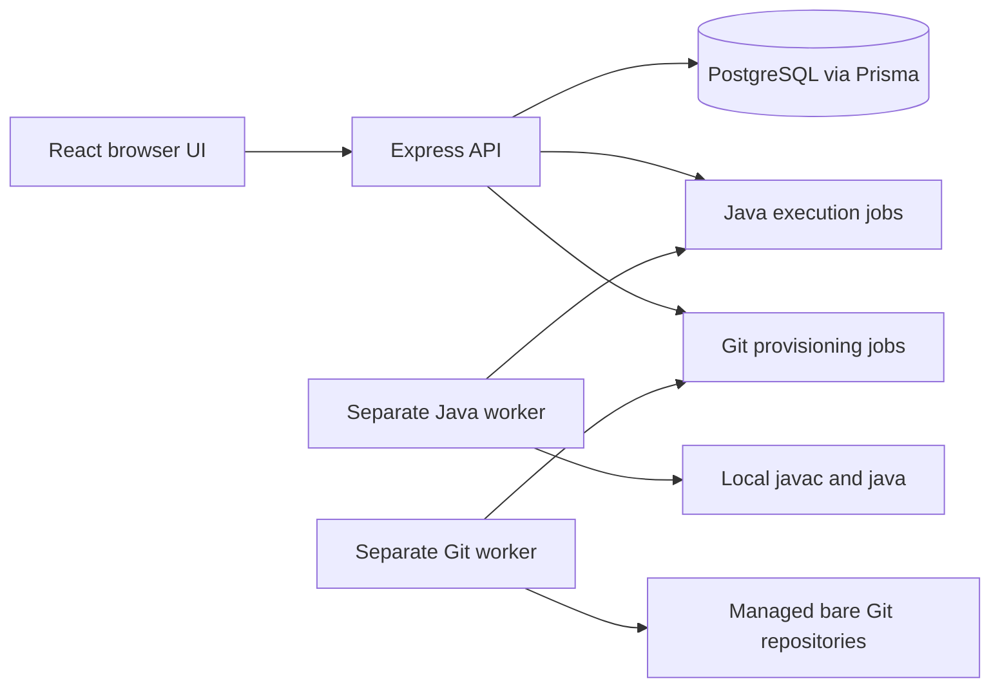

# Projex Current Project Status

Last reconciled: September 24, 2026

## Read this first

Projex began as a realistic hardcoded React prototype. It is now a working local-first full-stack system with a React frontend, an Express API, PostgreSQL persistence, Java assessment, and managed Git repositories.

This file is a teammate-friendly status summary. It does not override the code, migrations, tests, or the owning documents under `docs/architecture/`. If this summary becomes stale, repository evidence wins.

## Accepted baseline

- Stable tested commit: `af819aacf12f014321807e6cf80fc4b4b875cd77`
- Stable tag: `projex-lan-demo`
- Historical implementation: Phases 0 through 11
- Next work program: **Projex Iteration 2 — Classroom and Laboratory Readiness**
- Iteration 2 status: I2.1 core verified and pushed on Julius's task branch; not integrated into `development/fullstack`. Instructor Rerun is accepted for Freiser's checkpoint on `iteration-2/freiser-work-01` after the approved normal-local migration, authenticated desktop/narrow walkthrough, Checker review, and Julius's retention decision. Protected-branch integration remains separate; I2.2 has not started.

The stable baseline passed controlled local and Home LAN multi-device testing. This means it is an accepted demonstration baseline. It does **not** mean production-ready, Internet-ready, university-wide, or safe for hostile Java execution.

## System at a glance

- Frontend: React 19, Vite, JavaScript/JSX, React Router, existing CSS.
- Backend: Node.js, Express, TypeScript, Zod, Prisma ORM.
- Data: PostgreSQL.
- Java: the separate worker orchestrates the locally installed JDK; Projex did not build its own compiler and does not call an external compiler API.
- Git: PostgreSQL stores academic metadata; managed bare repositories store commits, trees, blobs, and refs.

## Feature truth

The labels below deliberately distinguish implementation from proof.

| Capability | Backend logic | Frontend UI | Database | Automated tests | Manual validation | Overall |
| --- | --- | --- | --- | --- | --- | --- |
| Login, sessions, CSRF, role routing | Reused | Integrated | Existing | Passed | Passed | Complete |
| Account setup and Admin account management | Reused | Integrated | Existing | Passed | Passed | Complete |
| Classes, class codes, email invitations, roster | Reused | Integrated | Existing | Passed | Passed | Complete |
| Programming activities and test cases | Reused | Integrated | Existing | Passed | Passed | Complete |
| Visible runs, official submissions, attempt state | Reused | Integrated | Existing | Passed | Passed | Complete |
| Latest/Highest credit, review, feedback, release | Reused | Integrated | Existing | Passed | Passed | Complete |
| Reopen a closed activity | Reused | Integrated | Existing | Passed | Passed | Complete |
| Project tasks, teams, invitations, repository review | Reused | Integrated | Existing | Passed | Pending broader real-workflow proof | Complete, needs more testing |
| Repository creation and provisioning | Reused | Integrated | Existing | Passed | Passed | Complete |
| Files, branches, commits, history, and diff inspection | Reused | Integrated | Existing | Passed | Passed with pushed content | Complete, read-only browser |
| Native Git clone/fetch/push | Reused | Integrated local guidance | Existing | Passed | Loopback only | Partial for lab use |
| Repository activity/contribution monitoring | Missing | Missing | Existing foundations only | Missing | Pending | Partial foundation |
| Cross-class Student To-Do | Missing | Prototype concept only | Existing data can be derived | Missing | Pending | UI and API gap |
| Global Student submission history | Existing records, no global product surface | Missing | Existing | Missing | Pending | UI/API gap |
| Global Instructor review queue | Existing records, no global product surface | Missing | Existing | Missing | Pending | UI/API gap |
| Java file import | Reused Run/Submit APIs | Implemented on I2.1 task branch | No change | Passed | Passed for selected demo | Not yet integrated |
| Improved textarea editor aids | Not needed | Implemented on I2.1 task branch | No change | Passed | Passed for selected demo | Not yet integrated |
| Instructor fresh rerun | Separate durable queue/API | Integrated on Freiser task branch | Two rerun migrations applied to Freiser's local `projex` | Guarded integration 19/90, client 46/296, Java 3/24; server isolated 221/224 with separate Windows failures | Authenticated Admin/Instructor/Student; Instructor 1280 px and 390 px passed | Accepted Freiser checkpoint; protected integration pending |
| Similarity indicators | Placeholder model only | Missing | Existing placeholder | Missing | Pending | Not implemented |
| Announcements, notifications, comments | Missing | Historical prototype concepts | No approved models | Missing | Pending | Deferred |
| Paired PostgreSQL and Git recovery proof | Tooling exists | Not applicable | No schema change expected | Partial | Not yet executed | Pending operational proof |
| Hostile-code Java isolation | Current limits only | Not applicable | No change expected | Partial | Pending | Not production-ready |
| SLU laboratory Git access | Loopback transport only | Local workflow only | Existing | Local tests passed | Lab network pending | Not implemented for lab |
| SLU laboratory deployment | Portable groundwork only | Existing product UI | Existing | Local/LAN passed | Lab pending | Not deployed |

## Important limits teammates must understand

- The browser does not create files, commits, branches, or tags. Native Git is the authoring path.
- Current Git Smart HTTP is loopback-only. A repository can be created in Projex, but approved laboratory computers cannot yet clone and push over the laboratory network.
- The Java worker is separate from the API, with time/output/process controls, but it still runs `javac` and `java` on the host. It is not an OS-level hostile-code sandbox.
- Project task and collaboration screens exist, but the full real-life instructor-to-team workflow needs additional manual testing with realistic exercises.
- Similarity detection, cross-class work queues, notifications, and complete contribution monitoring are not implemented.
- Home LAN browser validation did not expose Smart HTTP and was not an Internet deployment test.
- Backup and restore tooling exists, but a complete paired PostgreSQL plus Git-storage recovery proof remains pending.
- Instructor Rerun diagnostic/history records remain durable for Iteration 2 without automatic expiration or cleanup, separate from official attempts, assessment evidence, feedback, corrections and released scores. Three inherited Windows repository-storage/restore-verifier failures remain separately tracked in the rerun milestone.

## Iteration 2 feature-reporting rule

Never report a feature as simply “done.” Every milestone report must show:

| Layer | Allowed report values |
| --- | --- |
| Backend logic | New / Reused / Changed / Not needed |
| Frontend UI | New / Integrated / Missing |
| Database | Migration / Existing / No change |
| Automated tests | Passed / Missing |
| Manual validation | Passed / Pending |
| Overall | Complete / Partial / Backend-only / UI-only |

A backend endpoint without a usable frontend is **Backend-only**, not complete. A UI that still uses fake data is **UI-only**, not complete.

## Current source-of-truth order

When documents or chat summaries disagree, check in this order:

1. Current Git branch, commit, status, and diff.
2. Current source code and nearest tests.
3. Prisma schema and committed migrations.
4. Commands that were actually run and their current results.
5. The owning file in `docs/architecture/`.
6. This status summary and conversation history.
7. Historical audits and prototype documents.

## What the next teammate should do

Freiser's accepted Instructor Rerun checkpoint is on `iteration-2/freiser-work-01`; [INSTRUCTOR_REVIEW_RERUN.md](milestones/INSTRUCTOR_REVIEW_RERUN.md) owns its detailed evidence and limitations. Verify the current branch and pushed SHA before any new work. Integration into `development/fullstack` requires separate approval. I2.2 still depends on I2.1 integration and stable academic class projections; the academic foundation remains awaiting product/schema decisions. Do not start deployment or laboratory Git exposure. Follow [TEAM_DEVELOPMENT_WORKFLOW.md](TEAM_DEVELOPMENT_WORKFLOW.md) and [CODEX_PROMPT_PACK.md](CODEX_PROMPT_PACK.md).

## Updating this file

Update this summary only after evidence changes. Record the feature’s six-layer status, checks actually run, known limitations, and accepted commit. Do not paste credentials, environment values, private host paths, or volatile runtime details here.
