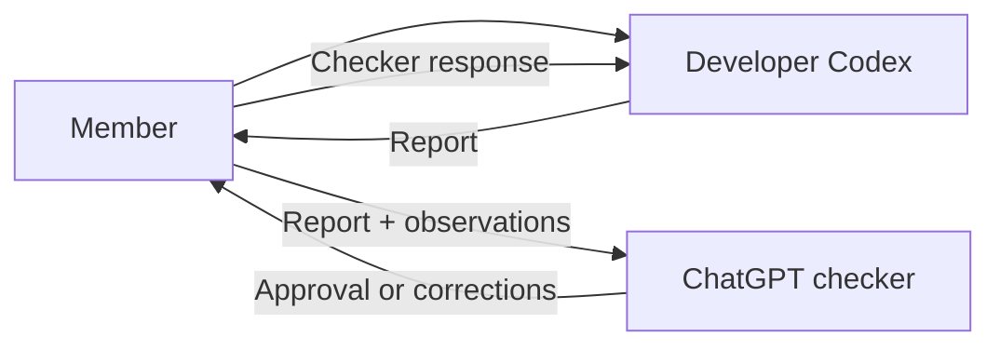

# Projex Team Development Workflow

## The simple workflow

One member owns development at a time. Julius hands a reviewed, pushed checkpoint to Freiser, then Freiser hands off to the next member in sequence. A rotation may last a week, but the branch name is based on the rotation number, not a date.

- **Codex is the developer.** It reads the repository, decides implementation details, writes code, tests the work, fixes related defects, and prepares reports.
- **ChatGPT web is the checker.** It reviews Codex’s report, checks alignment with the roadmap, and sends corrections when needed.
- **The member is the middleman.** They transfer the full report between Codex and ChatGPT and add what they personally observed.
- **Julius reviews integration later.** By team policy, only Julius merges into `development/fullstack` and `main`; this is not a claim of exclusive GitHub permissions.



## One branch for each member

Codex asks for the member’s preferred short name or GitHub handle and the rotation number from the handoff. If the rotation number is already documented, Codex confirms it instead of asking again.

It creates the member’s branch from the previous member’s exact reviewed, pushed handoff commit:

```text
iteration-2/<member>-work-<rotation>
```

Example:

```text
iteration-2/freiser-work-01
```

Keep Julius’s existing branch name unchanged. The member does not need to invent a base commit or milestone number: the handoff supplies the exact commit and rotation. If either is missing or differs from the pushed remote, stop and ask Julius.

Rules:

- Each member edits only their own member branch.
- The branch may contain several completed roadmap milestones.
- Members push only their own branch.
- By team policy, only Julius handles integration into `development/fullstack` and promotion to `main`; members do not merge or push either protected branch.
- Codex never force-pushes or rewrites history.
- The next member branches from the previous member’s **exact reviewed, pushed handoff commit SHA**, including documented WIP when approved for transfer. Codex verifies that SHA against the remote before branching. Do not substitute `development/fullstack`, create an extra integration branch or fork, or guess from a branch name.
- Each handoff records completed work, WIP, defects, actual automated and manual web-app checks, the next task, and the exact pushed SHA. An unrun or approval-blocked walkthrough stays explicitly pending; WIP is never called accepted.

## First-time setup

### 1. Clone Projex

Open PowerShell:

```powershell
git clone <PROJEX_GITHUB_URL> projex-ui
cd projex-ui
git fetch --all --prune
```

The clone example above is **not** the sequential handoff command. For unrelated work, use the real Projex GitHub URL in place of any placeholder. For this Iteration 2 continuation, use the exact branch and pushed SHA in the current handoff instead. Do not clone an older `development/fullstack` baseline or guess a base from the most recent-looking branch.

For the current Instructor Rerun continuation, read [INSTRUCTOR_RERUN_TEAM_HANDOFF.md](INSTRUCTOR_RERUN_TEAM_HANDOFF.md). If Julius’s WIP checkpoint is not yet reviewed and pushed, a fresh clone cannot contain that unfinished work. Do not start from `development/fullstack` and claim to be continuing it.

### 2. Install the existing packages

```powershell
cd client
npm ci
cd ../server
npm ci
npm run prisma:generate
cd ..
```

Both applications have committed lockfiles, so `npm ci` installs the versions already recorded by Projex. Do not upgrade packages during setup. In Windows PowerShell, `cd ../server` and `cd ..\server` are both accepted.

### 3. Prepare private local configuration

- Use `server/.env.example` only as a guide.
- Create `server/.env` privately.
- Get the approved local values from the project manager through a private channel.
- Never paste the full `.env`, passwords, tokens, cookies, or database URL into Codex or ChatGPT.
- Use your own loopback-only `projex` development database and a separate disposable `projex_test` database. Never point tests at normal or demonstration data. Migration of your normal database is a separate approval gate; the guarded integration runner may migrate and clear only its recognized test database.
- Keep your managed Git root separate from the test Git root and other members’ storage. Git source history does not contain PostgreSQL records or managed repository objects. A demonstration environment and any paired database/Git backup or restore need separate approval; see the current handoff.

### 4. Import the repository into Codex

1. Open the Codex desktop app.
2. Sign in with the member’s own account.
3. Open the cloned `projex-ui` folder as a local project.
4. If Codex asks for a primary folder, choose the `projex-ui` repository root.
5. Start a fresh Codex task.
6. Paste **Developer Setup Prompt** from [CODEX_PROMPT_PACK.md](CODEX_PROMPT_PACK.md).
7. Give Codex the member’s name when asked.

If continuing a WIP checkpoint, give Codex the current handoff document and have it verify the pushed checkpoint hash **before** creating the member branch. The handoff, not an old conversation, supplies the exact continuation base.

Codex will inspect the repository, create the member branch, read the roadmap, and explain what should be worked on next.

## Open the ChatGPT checker

1. Open a separate ChatGPT web conversation.
2. Paste **ChatGPT Checker Setup Prompt** from [CODEX_PROMPT_PACK.md](CODEX_PROMPT_PACK.md).
3. Provide these files when requested:
   - `AGENTS.md`
   - `docs/team/PROJECT_STATUS.md`
   - `docs/team/ITERATION_2_ROADMAP.md`
   - `docs/team/TEAM_DEVELOPMENT_WORKFLOW.md`
   - the active `docs/team/milestones/I2.X.md` report, when it already exists
4. Keep that checker conversation for the member’s rotation.

The checker may not have direct access to the local repository. It must review only the evidence it actually receives and must not pretend it ran Codex’s tests.

## Start working

After Codex completes setup, the member can simply say:

```text
Okay, start the current phase.
```

Codex will:

1. Confirm the next unfinished roadmap milestone.
2. Read its existing `docs/team/milestones/I2.X.md` report or create it from `MILESTONE_REPORT_TEMPLATE.md`.
3. Inspect the relevant code, tests, and architecture.
4. Decide the technical implementation details inside the approved scope.
5. Implement both backend and frontend when both are required.
6. Run relevant automated tests and a manual web-app walkthrough, then fix related defects. If a protected approval gate blocks live validation, document it as pending rather than claiming a pass.
7. Keep the milestone report consistent with accepted evidence.
8. Stop at protected decisions such as migrations on normal data, credentials, new architecture, dependencies, network exposure, or destructive operations.
9. Prepare a complete report when the milestone is ready.

The member does not need to write a detailed technical work order for every normal milestone. The roadmap, repository, `AGENTS.md`, and Codex inspection provide the details.

## Check a completed phase

When Codex says the phase is ready, it first updates the active `I2.X.md` milestone report. The member then says:

```text
Prepare the full report for the ChatGPT checker.
```

Copy the entire Codex report into the checker conversation. Add any manual observations, such as:

- what screen was tested;
- what looked wrong;
- what was confusing;
- what worked on desktop or phone;
- any product choice the member wants reviewed.

The checker returns:

- `APPROVED`
- `MORE EVIDENCE NEEDED`
- `CORRECTION NEEDED`
- `PROJECT MANAGER DECISION NEEDED`

If corrections are needed, copy the checker’s full response back to Codex. Codex checks it against the real repository, fixes valid in-scope findings, reruns tests, and produces another report.

## Begin the next phase

After the current phase is approved, the member can simply tell Codex:

```text
Okay, let’s begin the next phase.
```

Codex must first:

1. Confirm the completed phase and current Git state.
2. Update the completed milestone’s `I2.X.md` report with its final current status.
3. Find the next unfinished milestone in `ITERATION_2_ROADMAP.md`.
4. Create or read the next milestone report.
5. Explain the next milestone in simple language.
6. Continue on the same member branch.
7. Stop if the next milestone requires a protected decision that has not been approved.

## Saving work

Codex may create small, understandable commits and push them only to the member’s branch after the member approves the commit step.

Useful human-style commit examples:

```text
feat: let students import java files
ui: add line numbers to the code editor
feat: add the student work list
fix: protect repository activity from false attribution
```

Never use broad staging without reviewing the exact files. Never commit secrets, runtime storage, generated repositories, database dumps, build output, or unrelated changes.

## When the rotation ends

Ask Codex:

```text
Prepare the member handoff and push only reviewed work to my member branch.
```

The handoff must say:

- what was completed;
- what remains partial or unstarted;
- the branch and exact commit;
- automated tests and manual web-app walkthrough actually performed;
- failures or pending manual checks;
- known defects, WIP, and the next task;
- database, migration, dependency, and environment effects;
- the exact reviewed, pushed handoff commit SHA the next member must branch from.

Codex must also update every milestone report touched during the rotation so the next member does not need the old conversations.

The next member uses their own `iteration-2/<member>-work-<rotation>` branch from that exact SHA. They do not edit the old member’s branch or create an extra integration branch.

After the rotation, Julius reviews the latest accepted member branch and proposes its cumulative changes through a PR into `development/fullstack`, runs integration tests, and resolves defects through reviewed changes. Only after final acceptance does he propose a separate PR from `development/fullstack` into `main`. Both protected branches currently require a PR and one approval; Julius may need another eligible reviewer for a PR he authors. This is a team workflow rule, not a claim that GitHub technically prevents other members from opening PRs. Preserve each contributor’s genuine commit authorship.

## Running Projex locally

Use separate PowerShell windows. Replace `C:\path\to\projex-ui` with the real location.

### API

```powershell
cd C:\path\to\projex-ui\server
npm run dev
```

### Java worker

Run only when the approved local configuration enables Java execution:

```powershell
cd C:\path\to\projex-ui\server
npm run dev:worker
```

### Git worker

Run only when the approved local configuration enables Git provisioning:

```powershell
cd C:\path\to\projex-ui\server
npm run dev:git-worker
```

### Frontend

```powershell
cd C:\path\to\projex-ui\client
npm run dev
```

Normal development remains localhost-only. Do not enable LAN, laboratory, tunnel, or public exposure without separate approval.

## Protected decisions

Codex must stop before:

- changing product scope or major architecture;
- applying a migration to the normal development database;
- changing persistent credentials or environment configuration;
- destructive database or storage operations;
- weakening authentication, authorization, validation, privacy, or isolation;
- installing or upgrading an important dependency;
- LAN, laboratory, tunnel, or public exposure;
- merging into `development/fullstack` or `main`;
- deployment.

## Account safety

OpenAI accounts are intended for individual use. Teammates should use their own accounts rather than share login credentials. Git branches and the checked-in documentation transfer the Projex context between accounts.
